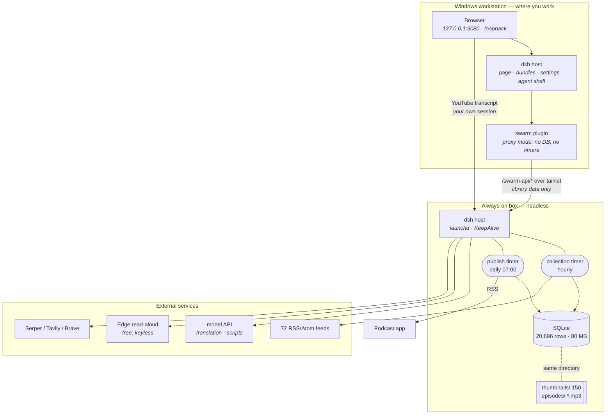
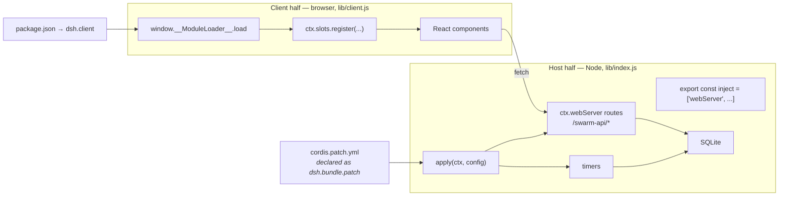
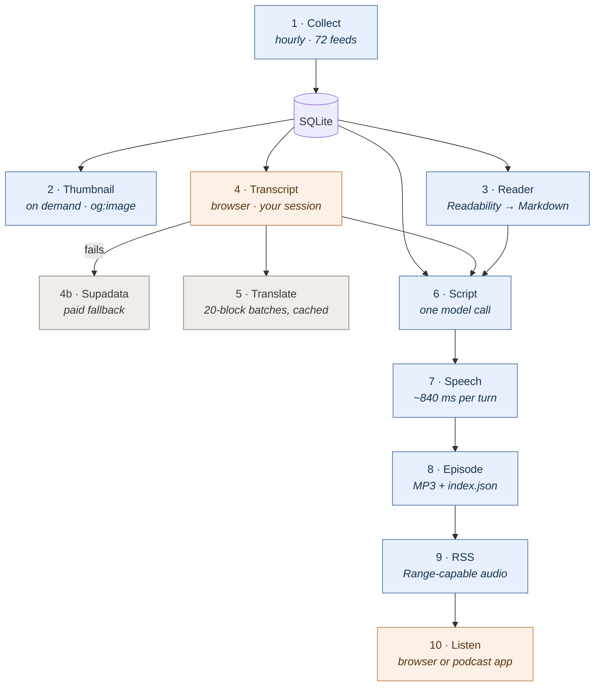
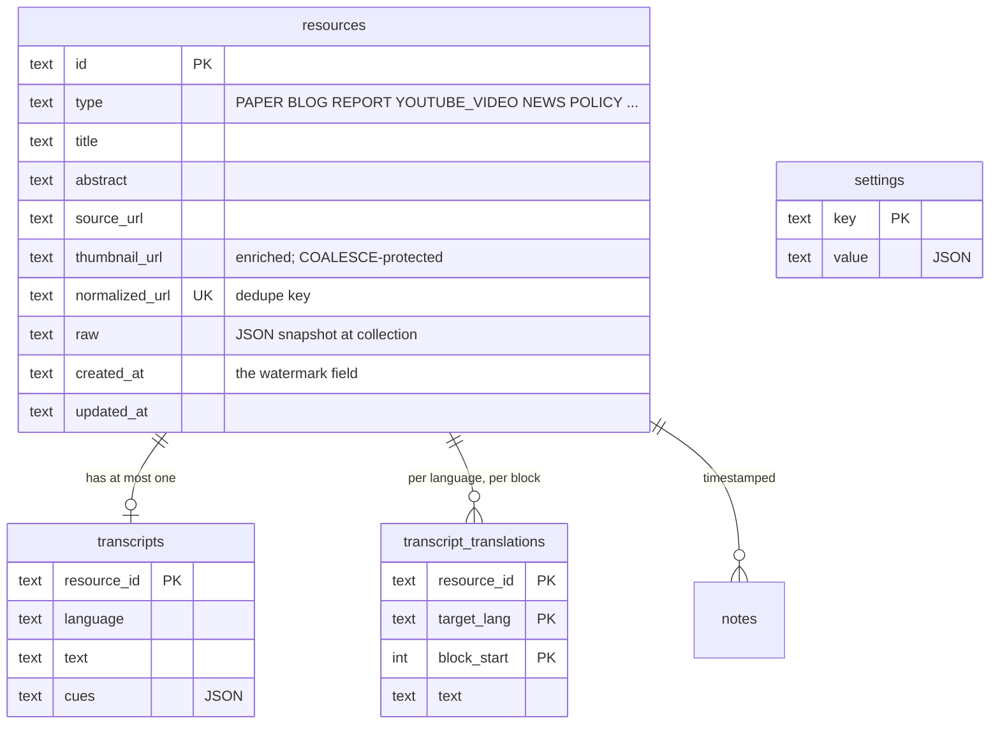

# Architecture

What this repository is, where every piece runs, and which parts are safe to
replace. Written to be maintained: each section says what is true today and
what would have to change to make it false.

Status as of 2026-08-23. The library and both timers run on `genesiss-mac-mini`
(macOS 26.3.1, Apple Silicon, 16 GB); the Windows workstation runs its own
harness and proxies `/swarm-api` to it over Tailscale. Section 2 says what runs
where and why.

---

## 1. What this is

Four third-party plugins for DeepSeek Harness. Three are small. One,
`dsh-agents-swarm`, is effectively a second application living inside the
harness's shell: its own database, its own HTTP routes, its own UI, its own
timers. It reads 72 feeds on an hourly timer and turns what it collects into
something you can read or listen to.

The harness supplies four things and nothing else matters: a plugin loader, a
UI slot registry, a model route, and an HTTP server to hang routes off.



The three constraints that fix this shape:

1. **The timers need a machine that stays on.** A desktop that sleeps collects
   nothing while it sleeps, and an episode generated at 07:00 needs something
   awake at 07:00.
2. **The database must sit on the same machine as the process that writes it.**
   The store opens it in WAL mode, and WAL needs shared memory that SMB and NFS
   cannot provide. Putting the file on a network share and keeping the process
   elsewhere is the obvious-looking arrangement that silently corrupts.
3. **Transcripts must be fetched by the browser.** YouTube has hardened
   `timedtext`; a server-side fetch returns an empty body for most videos. The
   browser fetch carries the viewer's own session, which is the only reason it
   works — so this one step is indifferent to where the host lives.

---

## 2. Where each piece runs

Two machines and a browser. The split is not a design goal — it exists because
the machine you work at and the machine that stays on are not the same machine.

| Piece | Runs on | Why there and not elsewhere |
|---|---|---|
| SQLite library (20,696 rows) | **Mac** | Must share a machine with the process that writes it — WAL needs shared memory a network share cannot provide |
| Thumbnails, episode MP3s | **Mac** | Paths derive from the library's; copying the library carries them |
| Collection timer (hourly, 72 feeds) | **Mac** | A machine that sleeps collects nothing while it sleeps |
| Publish timer (daily 07:00) | **Mac** | An episode made at 07:00 needs something awake at 07:00 |
| Every `/swarm-api` route | **Mac** | They serve the library, which is there |
| RSS feed + episode audio | **Mac** | A podcast client has to reach it when you are not looking |
| Outbound fetches — feeds, `og:image`, reader | **Mac** | Goes out over a residential connection, which bot protection treats far more gently than a hosting range |
| Model calls — translation, scripts | **Mac** → external | Initiated by the host; the key lives in `~/.dsh/.credentials.yaml` there |
| Speech synthesis | **Mac** → external | Edge read-aloud, free and keyless |
| Search — Serper / Tavily / Brave | **Mac** → external | Same |
| YouTube transcript fetch | **Browser** | Carries the viewer's own YouTube session, the only reason it works; indifferent to where the host lives |
| Playback, reading, everything you look at | **Browser** | Wherever you opened it |
| The page, its bundles, the settings panel | **Windows** | Served from loopback, so it never crosses the network and the loopback-pinned API stays reachable |
| Workspace, agent shell, file edits, git | **Windows** | The agent works on `D:\engineering\...`; the box's checkout is a copy the timers run, synced through GitHub |
| `/swarm-api/*` | **Windows → Mac** | Proxied, so the browser stays same-origin |

### Why the proxy, and not the browser talking to the Mac

A page served from the Mac would put the browser on a non-loopback origin, and
the harness pins fifteen methods — the whole settings and credentials plane
plus native dialogs — to loopback on purpose. `--trusted-host` does not unlock
them: that flag is a DNS-rebinding fence and says so in its own source. Fetching
cross-origin would also need CORS the host does not serve.

Proxying sidesteps both. The browser talks to `127.0.0.1` exactly as it always
did, the client half needed no change at all, and the network hop happens
between two servers where it is fast:

```
stats               40 ms
20 resources        55 ms   (17 KB)
1.5 MB episode     123 ms   (~12 MB/s)
```

The predecessor — an SSH tunnel carrying the whole UI — is gone. It failed
repeatedly, always looking like the service was down: an ssh session can lose
its far end and keep running, so the process stays alive, the port stays bound,
and every request hangs. The same 11 KB plugin bundle that takes 60 ms
server-to-server timed out through it and reached the browser as *"Failed to
load plugins"*. `deploy/README.md` keeps the full account.

**Which machine owns the library is configured, not detected.** Setting
`DSH_SWARM_REMOTE` makes a machine a viewer; leaving it unset makes it the
collector. Nothing guesses, because two collectors would fetch all 72 feeds
twice into two diverging libraries and publish two podcasts.

### Do you need a Mac?

**No, and you do not need two machines either.** Nothing here is macOS-specific
by design. What the deployment actually requires is one property:

> A machine that stays on, if you want collection and daily episodes to happen
> without you.

That yields three honest topologies:

| Topology | When it fits | Cost |
|---|---|---|
| **One always-on machine** | You have a box that is always up and you are willing to open a browser at it (or near it) | Simplest by far. No tailnet, no proxy, no split. This is the default the plugin ships as |
| **Just your laptop** | You accept that collection only runs while the laptop is awake | Zero setup. Feeds are hourly and forgiving; you lose the overnight window and the morning episode |
| **Split: workstation + always-on box** | Your daily machine sleeps and your always-on box is headless | What this deployment does, and the table at the top of this section |

The always-on box does not have to be a Mac. It needs Node 24 or newer, enough
disk for the library, and a network. A Linux server, a NAS that runs containers,
an old laptop with the lid closed — all fine. macOS shows up in
[`mac-mini.md`](./mac-mini.md) as `launchd`, an arm64 Node tarball, and a
directory-picker quirk; those are how *that* OS is served, not requirements.

One thing genuinely does argue for a machine **at home** rather than a rented
one: the collectors fetch 72 sites, and bot protection is markedly harsher on
hosting ranges than on residential connections. A VPS works, but expect more
sources to refuse it.

## 3. The four plugins

| Plugin | What it is | `lib/` |
|---|---|---|
| `dsh-agents-swarm` | The source library, reader, and podcast publisher | 10,108 lines |
| `dsh-web-search-serper` | One `ctx.web` provider routing to three search backends | 1,152 lines |
| `dsh-brand-mine` | Occupies the brand slots in the sidebar and hero | 104 lines |
| `dsh-agent-presets` | Agent presets under version control, republished at boot | 81 lines |

They are independent. Removing any one leaves the others working.

### How a plugin attaches

Every plugin has two halves that never share a process.



The client half is not bundled or compiled by the harness — it is a plain
`lib/client.js` registering a factory with `window.__ModuleLoader__`. That is
why it is written as `jsx(...)` calls rather than JSX syntax: nothing
transforms it.

### The slots occupied

| Slot | Kind | By | Note |
|---|---|---|---|
| `sidebar.footer.action` | list | swarm | additive — sits beside Settings |
| `shell.overlay` | list | swarm | the panel, frame-wide, click-through until it opts in |
| `settings.section` | list | swarm, search | added beside Models and Appearance |
| `sidebar.brand.mark` | **single** | brand-mine | registered at priority **-1** |
| `sidebar.brand.name` | **single** | brand-mine | same |
| `conversation.hero.brand.mark` | **single** | brand-mine | same |

**List slots are additive; single slots are not.** A second registration on a
single slot at the same priority is a collision, and the loader refuses the
whole plugin rather than picking a winner — which takes the entire UI down, not
just that slot. This is not hypothetical: `@linxin666/dsh-liangshen` claims
`sidebar.brand.mark` from 0.2.9, a profile pinned to `^0.2.1` picked it up on a
fresh install, and the page rendered nothing but the error. Lower priority
renders, so `dsh-brand-mine` now states `-1`.

---

## 4. The pipeline

Ten stages from a feed to something in your ears. Colour marks where each runs.



Blue runs on the Mac mini, orange in the browser, grey reaches an external
service (as do the model and TTS calls inside stages 5, 6, and 7).

**发布 is a group of formats, not a page.** The same selection of sources
becomes a podcast for the commute, a digest for the two minutes before a
meeting, or a report for the afternoon that needs the synthesis. All three
share every step but the last:

| Format | Ending | Artefact |
|---|---|---|
| 播客 Podcast | script → speech → concatenation | MP3 + an RSS entry |
| 摘要 Digest | ~500 words, one entry per source | Markdown |
| 报告 Report | ~1,400 words, grouped into themes with disagreements named | Markdown |

Two written formats rather than one because they answer different questions
and a single prompt asked to do both does neither. A digest answers *what
happened* and is deliberately refused the synthesis; a report answers *what it
means* and is worth the longer read precisely because it does that synthesis.

Documents are Markdown files with a JSON index beside the episodes, not rows in
the database — an artefact is something you can open in an editor, hand to
someone, or grep without going through this process at all.

**Scheduled publishing** wires 6 → 9 together. At the configured local time the
timer takes the newest sources collected since the last episode, runs the whole
chain, and records what it did. Design notes worth keeping:

- **Local wall-clock, not an interval.** "Every 24 hours" drifts with every
  restart until the episode arrives at three in the morning.
- **Catch-up is bounded to six hours.** A machine asleep at 07:00 and awake at
  09:00 still makes the episode. Unbounded catch-up means typing 07:00 at three
  in the afternoon fires one on the spot.
- **The window does not cross midnight.** Catching up would mean marking
  *yesterday* served, and the date stamp is what makes "already ran" answerable.
  Schedules near midnight lose their catch-up.
- **A thin day is skipped, not padded.** An episode from two press releases
  costs the same model call, takes the same place in the feed, and teaches the
  listener the feed is not worth opening.
- **Every armed format from ONE gathering.** `publishArtifacts` is a list, so
  a morning that produces a podcast and a digest reads the sources once. Each
  is attempted independently: a model that refuses the report is no reason to
  skip the podcast the same sources would have produced, and the run records
  which ones landed rather than reporting the whole morning as a failure.
- **A manual run reports separately.** `publishLastRun` is what tells the timer
  a day is served, so pressing *Run now* must not write it — but with no record
  at all, a legitimate skip produced nothing whatsoever, which is
  indistinguishable from a broken button. It writes `publishLastManualRun`.
- **A watermark, not a timestamp.** Each episode records the newest row it
  covered so the next starts there. It deliberately steps over rows it did not
  cover — a digest that works through a backlog falls further behind daily.

---

## 5. Data

One SQLite file. Everything else derives its location from it, which is what
makes the library a single directory you can copy.



`resources` has 20 columns; the ones above are the load-bearing ones.

**Two traps live in this table, both of which have already cost a day.**

`raw` is a snapshot of what the source handed over at collection time. Columns
written *afterwards* are invisible if a row is served from `raw` alone. This is
what hid 937 enriched thumbnails, and later what made every `createdAt`
comparison run against `undefined` — which would have made the podcast repeat
itself indefinitely without erroring. `withColumns()` in `store.js` layers
column values over the snapshot; anything new written as a column must be added
there or it will not reach the page.

`put` upserts, and the hourly collection re-writes every row it still sees. Any
column enriched later needs `COALESCE(excluded.x, resources.x)` or the next
cycle erases it. Today only `thumbnail_url` does.

### Where files live

```
~/engineering/dsh-db/                      ← pointer target
├── swarm-sources.sqlite                   80 MB, 20,696 rows
├── thumbnails/                            150 files — rescued, NOT re-fetchable
└── episodes/                              *.mp3 + index.json
```

Resolved in `lib/index.js:storePath()`, in order:

1. `DSH_SWARM_DB` environment variable
2. `~/.dsh/swarm-library-location.txt` — a one-line pointer file
3. `~/.dsh/storages/swarm-sources.sqlite` — the default

`thumbnailDir()` and `episodeDir()` are `dirname(storePath()) + "/…"`, so they
follow the database without separate configuration. **No path is hardcoded
anywhere in the code** — a regex sweep for drive letters over every `.js`,
`.ts`, `.yml`, and `.json` returns nothing.

---

## 6. HTTP surface

All under `/swarm-api` except where noted.

| Group | Routes |
|---|---|
| Library | `/resources`, `/resources/:id`, `/resources/search/suggestions`, `/resources/sources/facets`, `/stats` |
| Collection | `/collect`, `/collect/status`, `/collectors`, `/seed` |
| Config | `/config` (GET, PUT) |
| Media | `/thumbnail/:id`, `/thumbnail-for`, `/enrich-thumbnails`, `/video-info` |
| Fetch proxy | `/proxy/image`, `/proxy/pdf`, `/proxy/html`, `/proxy/reader` |
| Transcripts | `/transcript`, `/transcript/tracks`, `/transcript/ingest`, `/transcript/translation`, `/transcript/translate` |
| Notes | `/notes` |
| Model | `/chat`, `/quick-action` |
| Publish | `/publish/voices`, `/publish/script`, `/publish/render`, `/publish/jobs/:id`, `/publish/schedule`, `/publish/run-now`, `/publish/episodes`, `/publish/episodes/:id/audio`, `/publish/feed.xml` |
| Search *(separate plugin, `/web-search-api`)* | `/config`, `/test` |

Two shapes worth knowing. **Rendering is a job, not a request**: a ten-minute
episode is one model call plus ~40 synthesis round trips, and an HTTP request
held open for minutes reads as a hang. `/publish/render` returns a job id and
the page polls. **Episode audio answers Range requests** (206) — an `<audio>`
element seeking, and every podcast client, ask for ranges; answering 200 with
the whole body makes seeking silently reload from the start.

---

## 7. Seams

What can be replaced, at what cost. This is the section to read before planning
any change.

| Seam | How | Cost |
|---|---|---|
| **Machine** | Pointer file + env; no hardcoded paths | Configuration only — [`mac-mini.md`](./mac-mini.md) is the record of doing it |
| **TTS backend** | `TTS_BACKENDS` in `lib/tts.js`, each with a `local` flag | Add an entry. Kokoro (82M, faster than real time on Apple Silicon) would make speech never leave the building |
| **Search backend** | `BACKENDS = [serper, tavily, brave]` in the search plugin | Add a plain object |
| **Model** | Borrowed from `ctx.agentDefaultModel.currentSelection()`, read per request | Change it in harness settings; nothing here to touch |
| **Source roster** | `lib/sources.js` — 72 feeds as data, editable from the settings page | Data |
| **Database** | All 27 statements in `store.js`, one `node:sqlite` import | **Expensive — see below** |

### Why the database is a one-way door

It looks swappable: the SQL is in one file behind one import. It is not, and
the reason is not the dialect.

`node:sqlite`'s `DatabaseSync` is **synchronous**, so `store.query()`,
`store.put()`, and `store.getSetting()` are synchronous. There are 45 call
sites and **zero** `await`s. Every network database is async. Swapping to
Postgres is not 27 statements — it is making the store async and then touching
every caller, every route, and both timers.

**This is the right trade, not an oversight.** Single writer, single machine,
80 MB, embedded: SQLite is the correct answer, and wrapping it in an async
abstraction would be paying a real cost for a migration that will probably
never happen. But know the price: the day two machines need to write the same
library, that is a refactor of the call layer, not a driver change.

---

## 8. Operating it

### Is it alive

```sh
curl -s localhost:3080/swarm-api/stats             # library opened, and from where
curl -s localhost:3080/swarm-api/collect/status    # timer running, and its last runs
curl -s localhost:3080/swarm-api/publish/schedule  # standing order, last result, `waiting`
curl -s -X POST localhost:3080/web-search-api/test \
     -H 'content-type: application/json' -d '{"backend":"serper"}'
```

`publish/schedule` reports `waiting` — how many new sources the next episode
would draw on. Zero every morning means *collection* is broken, not publishing.
The search check reports `via: "seam"` when it went through `ctx.web.search()`,
the same entry the model's `web_search` tool uses; `via: "backend"` proves only
that the backend works, not that the harness routes to it.

**None of these prove the page loads.** They are all server routes, and all six
passed once against a UI that could not render at all. Open the browser.

### Logs and lifecycle

```sh
tail -f ~/Library/Logs/dsh.log ~/Library/Logs/dsh.err
launchctl kickstart -k gui/$(id -u)/team.genesis.dsh    # restart
```

`launchctl bootstrap` / `bootout`, not `load` / `unload`. The service is
published to the tailnet with `tailscale serve --bg --https=443 3080`; see
[`mac-mini.md`](./mac-mini.md#reaching-it) for what that exposes and the two
settings it depends on. Collection history
also lives in the database (last 30 runs) and is rendered in the settings page,
because `ctx.logger` output does not reach this harness's stdout.

### Deploying

The box updates itself every five minutes; nobody pulls by hand.

```
git push                      ->  autoupdate.sh on the box, within 5 min
                                    fast-forward (or rewind, if main was rewritten)
                                    setup.sh          reconcile the profile
                                    kickstart         restart the service
                                    wait 60s          does it answer?
                                      yes  ->  done
                                      no   ->  rewind to the previous revision,
                                               reconcile, restart, and exit non-zero
```

Two of those steps exist because their absence took the box down.

**`setup.sh` runs on every update.** Pulling is not deploying. A commit renamed
both plugins under an npm scope; the checkout followed and the profile did not,
so the Loader looked for `@ai4gensteam/dsh-web-search`, found the old name, and
the harness exited on boot. `setup.sh` is idempotent, and it *merges* — the box
carries two plugins this repo does not own (`dsh-brand-mine` and
`@linxin666/dsh-liangshen`) and they survive it. It recognises its own entries
by the directory they link to as well as by name, which is what lets a rename
land on a machine that still has the old one.

**A revision that does not answer gets rewound.** The previous one was serving
a minute ago; a box up on yesterday's code is worth more than one down on
today's. The run still exits non-zero, because the update did fail.

`autoupdate.sh` re-execs itself when a pull changes it. bash reads a script from
disk by byte offset as it runs, so replacing the file underneath a running shell
does not reload it — it keeps reading, at the old offset, out of the new bytes.
That produced a run that pulled with one version and deployed with the version
it had just overwritten.

### Releasing to npm

`deploy/release-check.sh <swarm-version> <search-version>` installs the
published versions into a throwaway `DSH_HOME` and boots a real harness on
them. Nothing cheaper is sufficient — see the last row of §9.

### Tests

```sh
cd dsh-agents-swarm && npm test        # 25 tests, node --test
```

They cover the scheduling logic specifically — date math, the catch-up window,
the watermark, the config whitelist — because every way that code can be wrong
is silent.

---

## 9. Failures that do not announce themselves

The most valuable thing in this document. Each of these has actually happened.

| Symptom | Cause |
|---|---|
| Enriched data never appears | Read went through `raw`, not `withColumns()` |
| Enrichment erased every hour | `put` overwrote instead of `COALESCE` |
| Podcast repeats itself | `createdAt` absent from `raw`; every comparison against `undefined` |
| Schedule never fires | `publishAt` unparseable reads as "no schedule". Now rejected on write |
| Rejection with an empty reason | `problems.push()` with no argument |
| Episodes store zero turns | `saveEpisode` checked `Array.isArray` against an object |
| Host B speaks in Host A's voice | Label matched only exact lowercase `"b"` |
| Plugin runs stale code | `ln -s` under Git Bash on Windows makes a directory **copy**. Check for `l…->`, not `d…` |
| Whole UI blank | Two plugins on one single slot at equal priority |
| Install "succeeds", something fails later | npm blocks native build scripts and reports it as a **warning**, exiting 0. The reverse also happens: the same warning from a package that ships its build output means nothing, and reading it as a failure is its own wrong answer |
| Library serves fine, translation fails | `.credentials.yaml` not moved — `settings.yaml` names the provider but not its key |
| Over-reported date comparisons | `datetime('now')` renders with a space, stored ISO uses `T`, and `'T' > ' '` |
| Feed lists episodes, none download | Enclosures hardcoded `http://` behind a TLS-terminating proxy |
| Published package cannot be mounted | `npm pack`, install, import and its own tests all pass — none of them asks a harness to *mount* it, which is the only thing a consumer does |
| Box down after a clean pull | A rename needs a profile change; the update path only touched the checkout |
| `npm install` says a just-published version does not exist | Install resolves against the packument, which is rebuilt after the version URL starts answering |

A pattern runs through these: **the check that passes is not the check that
matters.** A route answering 200, an install exiting 0, a plugin reporting
itself enabled — none of them is evidence about the thing you actually wanted.

---

## 10. Where this stands

**Real and complete.** The source library (20,696 rows, reader, transcripts,
translation, on-demand thumbnails) and publishing (script, speech, episodes,
RSS, daily schedule). Both do things the chat window cannot: one is a reading
surface for a corpus too large to page through in conversation, the other
produces an artefact you can take with you.

**Empty.** Three of the five panel tabs — 洞察, 研究, 推演 — render a lede and
nothing else (`lib/client.js`, the ternary at line 3730). The five-stage
pipeline was copied from gens.team's backend module names
(`explore / insight / research / simulation`); it is their information
architecture, not one derived from how this gets used.

The open question is not scheduling but existence. Extracting claims,
digging into one, projecting it forward — the harness's chat window already
does all three, with tools and multi-turn context. Building a tab, a schema,
and a UI for each risks rebuilding the chat window worse. Either fill them with
something that is genuinely not chat-in-a-box, or cut them and ship two tabs
that are complete.

**Outstanding.**

- `sudo pmset -a sleep 0 disablesleep 1` on the Mac — not run; needs a
  password. `pmset -g` currently reports sleep prevented by an *application
  assertion*, which ends when that application quits. Everything else survives
  a reboot; this does not.
- The Windows copy at `D:\engineering\dsh-db\` is a point-in-time snapshot from
  the migration and goes stale immediately. Do not run collection on both.
- Local digital-human video stays behind an API. MuseTalk specifies CUDA; the
  Apple Silicon paths are community forks, and 16 GB shared with the OS means
  minutes per clip. The audio layer — the substance of the publish tab — runs
  on the Mac for nothing.

---

## Related

- [`mac-mini.md`](./mac-mini.md) — the migration, as carried out, including the
  four steps the first draft got wrong.
