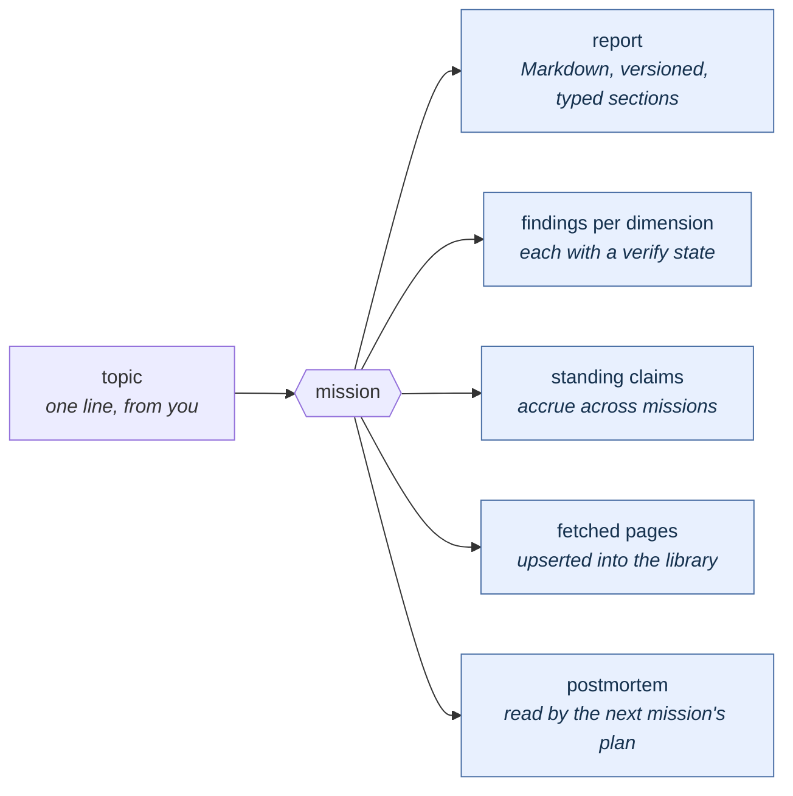
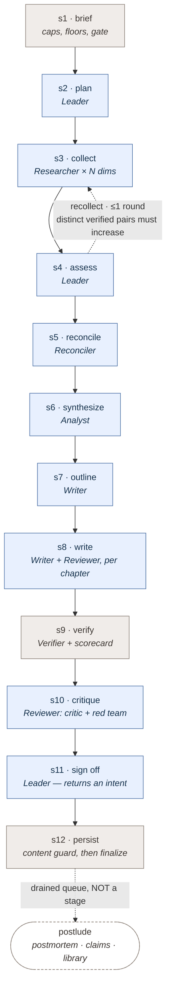

# 洞察 as a mission

What replaces the hourly extraction batch, why a mission rather than a pass,
and what has to be built in what order. Written to be built from: every section
says what the thing is, what failure it exists to prevent, and what it costs.

Status: design, revision 2, 2026-08-24. Nothing in §2–§9 is built. Revision 1
was reviewed against the actual target — the plugin's own source, the harness
LLM contract, and the live library measured row by row. Six of its load-bearing
assumptions were false. They are corrected here, and §13 says which and why.

The reference is `genesis-agent-teams`' agent playground: seven collaborating
agents, a thirteen-step pipeline, and two years of production scars written into
its comments. This document is not a lightweight version of it. It is the same
workflow, the same reliability mechanisms, the same availability mechanisms and
the same tool discipline, rebuilt for one process with one model — and in four
places it goes further, because one process with one model can do things a
multi-pod cloud service cannot. §10 names those four and is honest about the
five places this is strictly worse.

---

## 0. What is thrown away, what is not, and what turned out not to exist

The current 洞察 pass is an hourly background batch. It reads rows written since
a watermark, shingles them into clusters, asks the model for claims, verifies
the quotes, and files the survivors. It works. Measured on the real library it
produced seven claims, all of them `candidate`, none reaching the
two-independent-source threshold — so the tab would have been empty by
construction, and `insight-corroborate.js` exists because of that measurement.

The diagnosis in that file is right, and it is bigger than the file:

> "Are multiple independent sources reporting this?" cannot be answered from a
> slice of what a feed reader happened to fetch; it is a question you answer by
> going to look.

Corroboration went to look. But the *subject* is still whatever the feed
happened to deliver in the last hour. Nobody asked for those claims. The unit of
work is a timer tick, so the output is a pile of assertions about an arbitrary
window, and no amount of scoring turns a pile into an answer.

**The unit of work is wrong; the machinery is not.**

### 0.1 What the library actually contains

Revision 1 called the library "20,708 curated rows whose text is already
fetched" and built two of its five advantage claims on that. The database was
measured:

```
resources                    20,696
  abstract present           19,179   avg 234 chars   max 4,942
  ai_summary present            117   avg 289 chars
  content column             DOES NOT EXIST
transcripts (real full text)     14
type mix   NEWS 14,294 · BLOG 4,151 · PAPER 828 · REPORT 750 · POLICY 367 · YT 306
```

There is no body-text column in `resources` (`lib/store.js:40`). `podcast.js`
builds a quotable block as `firstText(aiSummary, abstract, content)` and
`content` resolves to nothing. So the library is **a lead index, not a corpus**:
20,696 pre-filtered titles, URLs and publication dates, of which 19,179 carry a
short publisher-written abstract.

That is a demotion, and it is worth being precise about what survives it,
because "blurb" is too dismissive:

| Text | Rows | Whose words | Admissible as evidence |
|---|---|---|---|
| `abstract` | 19,179 | the **publisher's** — a paper's real abstract, an article's standfirst | **Yes, at a discount.** One short span; enough to source a specific claim, not enough to source an argument |
| `ai_summary` | 117 | **this program's model** | **Never.** Quoting it verifies perfectly and attributes our own words to the source — the exact failure `UNQUOTABLE_MARKERS` was written for |
| `transcripts` | 14 | the speaker's | Yes, subject to the sampled-gap rule already in `insights.js` |
| fetched page text | 0 today | the publisher's | **Yes.** This is the real substrate, and today it does not exist |

Three consequences run through the rest of this document:

1. **`fetch_page` is the only supplier of deep verifiable spans.** Every gate
   that counts verified findings is therefore gated on a paced network call,
   which puts fetch pacing into the wall-clock floor (§1) and into the budget
   pool as its own ceiling (§8).
2. **`library_get` cannot return "the document text."** It returns a title, a
   URL, a date and an abstract. Its job is **triage and lead generation**, which
   is genuinely valuable and genuinely free — just not the job revision 1 gave
   it.
3. **The corpus has to be built.** `mission_documents` is where fetched page
   text lands, and the upsert that grows the library from it moves from phase 5
   to phase 1, so the corpus starts existing on the first real mission.

### 0.2 What is kept

| Kept | Where | Why it survives |
|---|---|---|
| Contiguous-span quote verification | `insights.js` — `verifyQuote`, `normalizeForQuote`, `quotableSpans`, the two length floors, `UNQUOTABLE_MARKERS` | The highest-value guard in the design, and the thing the reference does not have at all. §7 and §10 both turn on it |
| The request pacer, and refusal ≠ empty | `insight-corroborate.js` — `createPacer`, `rateLimitReason`, `searchArxiv`, `searchWeb` | arXiv publishes one request per three seconds across every machine you run, with blocking as the remedy. A pacer per process is *exactly correct* here in a way it can never be in the cloud |
| The search and fetch layer | `insight-corroborate.js` — `readHit`, `isIndependent`, `hostOf`, `buildQueries`; `proxy.js` — `admissibleUrl`, `fetchDocument`, `readArticle` | Independence by host; the status and content-type checks before Readability; the 200-character floor below which a page is a paywall notice. Each is a bug already paid for |
| The provenance decisions | `docs/insights.md` §1, §3 | A claim is a standing statement with provenance that accrues evidence; independence is by source, not by article; `stance` makes disagreement first-class. Settled, not re-litigated |

**"Kept" means the guarantee is kept, not that the file is immobile.** Revision 1
promised these files were unchanged and then specified four things that require
changing them. The honest list of edits to existing code, all of which preserve
every rule the comments defend:

| File | Edit | Why |
|---|---|---|
| `insights.js` | `verifyQuote` returns `{ok, resourceId, spanIndex, reason}`; export `quotableSpans` | `mission_findings.span_index` cannot be written otherwise, and re-verification needs to know which span matched |
| `insights.js` | `UNQUOTABLE_MARKERS` gains the `ai_summary` case via a tagged block builder (§3.6) | 117 rows of model-written prose are currently quotable |
| `insight-corroborate.js` | Pacers move to `lib/pace.js` as named singletons and are re-exported | They are module-private today; a second `createPacer(4000)` doubles the arXiv rate |
| `lib/pace.js` | `createPacer(ms)` takes a signal, checked **inside** the chained closure | A queued thunk currently runs after cancellation |
| `proxy.js` | Manual redirect loop re-running `admissibleUrl`; size check before buffering | `redirect: "follow"` never re-checks the hop, and the body is fully resident before `MAX_BYTES` is tested |
| `store.js`, `insight-store.js` | Six `BEGIN`/`COMMIT` sites move onto one shared `withTx` | §5.0 — this is the single most destructive defect found |

### 0.3 What is replaced

| Replaced | Why |
|---|---|
| `insight-extract.js` — the pass, its watermark, its 60-second tick | The tick is the wrong unit. A mission has a subject |
| `insights.js` — clustering, scoring, the four tests *as a pipeline stage* | Novelty, relevance, credibility and momentum survive as scores on a standing claim (§4.8). They stop being a stage |
| `insight-store.js` — the pass's own SQL and its run records | The `insights` / `insight_evidence` tables survive as the cross-mission claim ledger. Everything that reads a watermark goes |
| `insight-routes.js` | Replaced by §9's mission routes |

Nothing above is deleted before its replacement runs. The hourly pass keeps
working until §11 phase 5, and the setting that arms it
(`insightIntervalMinutes`, default `0` — off) is what turns it off. Because both
writers are alive for two phases, the claim ledger gains an `origin` column
(`pass` | `mission`) from the **first** mission write, not at the cutover: two
writers with different provenance rules and different independence accounting,
distinguishable only by a setting a user can flip, is how a ledger quietly
becomes unauditable.

### 0.4 Where this runs

`apply()` short-circuits **totally** on a remote library (`lib/index.js:1590`):
a machine proxying someone else's library registers a proxy handler and returns,
with no `SourceStore`, no `insightStore`, no `chat`, no timers. The machine this
document was written on is in that mode (`~/.dsh/swarm-library-location.txt`
points at a tailnet host).

**Missions run only where the library is local.** In proxy mode the tab shows
one line — "missions run on the machine that holds the library (`<host>`)" — and
no mission surface. This is stated rather than discovered because every §4 table,
the synchronous `library_search` and the boot sweep are absent there, and half of
§10's advantages are advantages *of* locality. Making missions work through the
proxy would make `library_search` an async paced HTTP call and invalidate §10.2
and most of §10.4 on exactly the machines that use it. That is a different
product; it is not this one.

---

## 1. What a mission is

**You type a topic. That is the whole input.** Everything else is a default with
an override.

> A **mission** is one bounded investigation of one topic, run by seven agents
> across twelve stages, producing a signed report whose **evidenced sections**
> carry, for every claim, a quote checked against a contiguous span of a page we
> fetched — and whose **interpretive sections** are marked as such.

Four words there are doing work.

**Bounded.** A mission declares its ceiling before it starts and cannot exceed
it. Not as a hope: §8's budget pool is a single object every agent's accountant
reports into, and the pool aborts the mission when it drains. The ceiling is
five numbers rather than one — tokens, wall clock, arXiv requests, web-search
calls, page fetches — because locally those are five genuinely different
scarcities and only one of them is money. A sixth quantity, the model's context
window, is not a ceiling the user sets but a limit every stage must plan under;
§8.5 handles it separately for that reason.

**Signed.** A mission ends when the Leader signs the report or refuses to. A
refusal is a first-class terminal state (`quality-failed`), not an error: the
work happened, the report exists and can be read, and the Leader declined to put
its name on it with a machine-readable reason. Every other quality mechanism in
§2 exists to feed that one decision. If you port only part of this design, port
the sign-off and its inputs; the rest is elaboration. And the sign-off is not
advisory: §3.2's forced-unsign ladder deterministically overwrites a signature
that contradicts the scorecard, because a mechanism the Leader *may* consider is
a mechanism about a prompt.

**Checked.** A claim with no verbatim quote from a page we fetched is discarded,
not repaired. That rule already exists in `insights.js` and is already enforced.
What is new is that it moves *inside* the agent loop: a `finalize` carrying an
unverifiable quote is rejected back to the model with the failing quote named,
rather than being filtered after the fact by code the model never hears from.

**Marked.** Revision 1 promised "every claim carries a quote." That was not true
of the artefact, and overstating it is itself a failure mode — the reader trusts
the unevidenced half *because* of the evidenced half. The Analyst's foresight,
the Reconciler's alternative hypotheses and the Reviewer's blindspots are the
most confident-sounding material in the report and none of it is quotable
evidence. So sections are typed. `evidenced` sections carry citations and are
scored on citation coverage. `interpretive` sections are rendered under a marked
heading, must each name at least one `fact_id` they reason from, and are reported
separately by §9's scorecard — so "chapter 7 has zero citations" is visible
instead of averaged into a healthy ratio.

### What a mission produces



Five artefacts, and the last three are the reason this is worth building rather
than asking the chat window. The report answers today's question. The claims,
the pages and the postmortem make the *next* mission better: claims accrue
evidence across missions the way `docs/insights.md` §1 says they must, every page
fetched during a mission lands in `mission_documents` **and is upserted into the
library as real body text**, and the postmortem is read back by the next plan.

That upsert is now load-bearing rather than tidy. §0.1 measured a library with no
body text; the only way it acquires one is missions putting it there. A library
that has run fifty missions is a materially better library than one that has run
none, and that compounding is the strongest long-run argument for the whole
design.

### What a mission costs

Three depth tiers, one table, served over HTTP so nothing else holds a copy (§8).

| | `quick` | `standard` | `deep` |
|---|---|---|---|
| dimensions | 3 | 5 | 8 |
| stages run | 8 of 12 | 12 | 12 |
| verified findings per dimension, **initial target** | 4 | 5 | 6 |
| report, main body | ~3,000 words | ~9,000 words | ~25,000 words |
| model calls, ceiling | 40 | 120 | 300 |
| tokens, ceiling | 400k | 1.5M | 4M |
| arXiv requests, ceiling | 20 | 60 | 150 |
| web-search calls, ceiling | 30 | 120 | 300 |
| page fetches, ceiling | 30 | 100 | 250 |
| wall clock, cap | 20 min | 60 min | 3 h |
| **wall clock, floor from pacing alone** | **~3.5 min** | **~10 min** | **~24 min** |

Two rows changed meaning since revision 1, and both changes are corrections.

**The floor is a sum, not the arXiv term.** Revision 1 computed it from arXiv
alone and got 80 s / 4 min / 10 min. The real floor is

```
floor = max_arxiv × 4 s                    arXiv pacer
      + max_fetch × (1 s + parseP50)       fetch pacer + jsdom/Readability
```

and the second term is the larger one at every tier. jsdom parsing is
**blocking CPU on the shared event loop** — hundreds of milliseconds to seconds
per page, during which the SSE stream, the hourly collector and the harness UI
are all stalled — so it is wall clock in the strictest sense. `parseP50` is
measured by phase −1 and stored in settings; the table above assumes 2 s pending
that measurement, and `s1` prints the sum it actually computes. Parses are
serialised one at a time with a yield between them, which is why the term is
additive; moving jsdom to a `node:worker_threads` pool is a deferred option,
taken only if the measured p50 makes it worth the complexity of shipping DOM
work across a thread boundary.

**"Verified findings per dimension" is an initial target, not a constant.**
Revision 1 hard-coded 4/5/6 into nine places — the tier table, the researcher's
`check()`, the stage quality floor, `s4`'s `meetsFloor` flags, the Leader's
`qualityBar`, the chapter supply contract, the reviewer's citation floor and the
sign-off conditions — without ever estimating the verify pass rate that produces
them. §3.5 correctly establishes "supply decides demand" for chapters and then
ignores it one stage earlier. So: the tier value seeds the plan, and after `s3`
the **operative floor is derived from measured supply** —
`floor = clamp(2, tierTarget, round(medianVerifiedPerDimension))` — with `s4`
comparing dimensions against that, and the number living in exactly one variable
that both the prompt and the gate read. A floor nothing can reach is how chapters
rewrite until wall-time.

The word counts deserve a note, because the reference got this wrong and knew it.
Playground's `deep` tier targets 150,000 words; its own cost-strategy document
names that as the second-largest cost driver and proposes 20k–35k, and that
proposal never shipped. We take the recommendation at design time, for nothing.

**`quick` runs eight stages, not twelve.** A three-dimension, 3,000-word mission
does not need a Reconciler adjudicating conflicts among twelve findings, a
mission-level outline, or a red team. It runs `s1 · s2 · s3 · s4 · s8 · s9 · s11
· s12`; `s5`, `s6`, `s7` and `s10` declare `tiers: ["standard", "deep"]`. This is
not a cost optimisation, it is a development-loop fix: `quick` is the tier every
prompt-regression test and every manual check runs on all day, and revision 1
made it pay the full 40-call ceiling.

**`s9`, `s11` and `s12` are tier-invariant.** Whatever else `quick` skips, it
does not skip verification, sign-off or the content guard, and its single-call
report is produced through the same assembly code that builds `sections` and
`citations` for the other tiers. A cheap tier that reaches a terminal state by a
path the expensive tiers never take is a cheap tier whose test results mean
nothing.

---
## 2. The twelve stages

Playground runs thirteen orchestrated steps plus a fire-and-forget postlude, and
describes itself as twelve, thirteen or fourteen depending which file you read —
the config declares thirteen, the catalogue name says fourteen, the registration
log says fourteen, and the stage-number table maps thirteen ids onto eleven
distinct numbers. **Twelve here, enforced by a test that counts the array.** A
pipeline whose own length is ambiguous cannot have a correct checkpoint (§5.4),
and playground's is: because `s8b` shares stage number 8 with `s8`, a checkpoint
saved after `s8` lists `s8b` as completed, and a crash between them silently
skips the whole section-quality stage on resume while reporting success.

Revision 1 reproduced the same ambiguity it opens by criticising — a mermaid node
`S13`, a thirteen-row table, and a phase plan saying "twelve no-op stages". The
learning work is therefore named **postlude**, is not a stage, is not in the
stage array, and is not seen by `validateStageDag()`. `mission_stages` holds
exactly twelve rows for every mission at `standard` and `deep`, and exactly
twelve rows at `quick` too — four of them written `skipped-by-tier` at `s1`, so
the count is invariant and the UI never has to guess whether a missing row is
pending or excluded.



Blue stages spend model calls; grey ones are arithmetic. `s9` is grey and has an
agent in it, which is the point of §10.1.

### The stage contract

A stage is a declaration, never code:

```js
{
  id: "s3-collect",
  agent: "researcher",           // or null for a code stage
  mode: "fan-out",               // plan | fan-out | synthesize | draft | review | signoff | persist
  tiers: ["quick", "standard", "deep"],   // absent from a tier ⇒ row written `skipped-by-tier`
  stallMs: 900_000,              // visibility only — see below
  inputBudgetTokens: 60_000,     // §8.5. Checked before dispatch, with a named shrink ladder
  dag: {
    reads:      ["plan"],
    writes:     ["findings"],
    dbWrites:   ["dimensions", "findings", "evidence", "documents"],
    successors: ["s4-assess", "s5-reconcile", /* … the closure, spelled out */],
    backEdge:   null,            // s4 alone declares one
    rerunable:  true,
    invalidates:["findings", "facts", "report"],
  },
}
```

`successors` is the transitive closure written out literally, not computed, so a
cascade is auditable by reading it. `validateStageDag()` runs at **plugin init
and throws** — successors must exist, `rerunable: false` must carry a reason, and
no successor may appear earlier in the array except through a declared
`backEdge`. Playground validates the same invariants only inside a test file,
which means a bad edit ships if the test is not run.

**A stage returns `{output, degraded}`, and `degraded` is a required field.**
Revision 1 made `markStageDegraded` a hard invariant policed by "a reviewer greps
for it", which is the same class of thing this document exists to eliminate.
Inverting it costs nothing: the runner rejects a stage return that omits the
field, so a stage that swallowed something and continued has to write
`degraded: false` explicitly — an assertion someone can be wrong about on
purpose, rather than an omission nobody can see. The grep survives as a lint
test: a `catch` block anywhere in `lib/mission/**` must contain a `throw`, a
`degraded:` assignment, or a comment saying why neither.

**No stage has a kill timer.** `stallMs` emits one `stage:stalled` notice and
nothing else. This is the single most important lesson in the reference and it
costs nothing to adopt: playground deleted its per-stage deadline on 2026-05-06
after it repeatedly killed fan-outs that were demonstrably alive, emitting a
progress event every second, because the deadline could not see sub-events. Real
termination comes from three places only — the mission wall timer (§8), the
no-progress guard (§5.3), and a terminal `error` finish from the model seam
(§3.0). That matters *more* locally, where a paced arXiv round and a serialised
jsdom parse make a long-but-healthy stage the normal case.

### Why each stage exists

| Stage | Agent | Consumes | Produces | Why it is here |
|---|---|---|---|---|
| **s1 brief** | — | topic, depth, overrides | caps, floors, `mission:started` | Resolves the five ceilings once, converts the plan into a wall-clock floor from the rate limits *and the parse cost*, and refuses a mission that cannot fit. `rerunable: false` — a budget gate cannot be re-run, you start a new mission |
| **s2 plan** | Leader | topic, last 3 postmortems, **library lead census** | `dimensions[]` with facets, `goals` with `successCriteria` and `qualityBar` | The mission needs an accountable owner who declares its own success criteria at the start and is graded against them at the end. Empty `dimensions` is fatal here, not later |
| **s3 collect** | Researcher × N | one dimension | `findings[]`, each `{claim, evidence, source, documentId, spanIndex, verifyState}` | The only stage that reaches the network. Library for leads, arXiv and web for more leads, `fetch_page` for evidence |
| **s4 assess** | Leader | per-dimension outcomes with **precomputed** pass/fail flags against the derived floor | one decision + per-dimension actions | The Leader reviews its own researchers. The precomputed flags are the highest-leverage prompt lesson in the reference: never make a model do the arithmetic that decides its own verdict |
| **s5 reconcile** | Reconciler | **verified findings only**, all dimensions | fact table, conflicts, overlaps, gaps, competing hypotheses | N parallel researchers produce contradictions nobody would otherwise resolve. Blocking, not an optional log |
| **s6 synthesize** | Analyst | fact table + reconciliation | insights, contradictions, foresight, quick-view cards | Turns evidence into a position, including falsifiable forecasts with numeric probability, stated resolution criteria, and a named `fact_id` each |
| **s7 outline** | Writer | plan + fact table | chapter outlines, word allocation, **fact allocation**, section types | Facts are assigned to chapters *before* the chapters are written, so concurrent chapters cannot both claim a fact or both drop it |
| **s8 write** | Writer + Reviewer | one dimension's verified findings + its outline | chapters, then the assembled report | The write→review→revise loop, per chapter, with five bounded escape hatches (§3.5) |
| **s9 verify** | Verifier + code | the assembled report | citation verdicts + a mechanical scorecard, **per section type** | **The stage playground has an agent for and never wired.** See below |
| **s10 critique** | Reviewer | the report summary, **its section headings, and the fact table** | blindspots, biases, forecast vulnerabilities | An independent reader that never saw the drafting reasoning, plus a pre-mortem on every prediction |
| **s11 sign off** | Leader | everything above, including the scorecard | foreword, then a signature **intent** | The one decision the whole mission converges on. It does **not** write the terminal row |
| **s12 persist** | — | the signed intent | content guard, then the single arbitrated terminal write | Independent anti-fake-completion checks, then exactly one terminal write |
| **postlude** | — | the event log | postmortem, claims, library upserts | Not a stage. A drained queue (§5.6) |

### Two rules about who may end a mission

Revision 1 said `s11` produces "signature or refusal", that a refusal is the
terminal state `quality-failed`, and that `s12` performs "exactly one arbitrated
terminal write." Those cannot all be true. If `s11` writes the status, `s12`'s
`finalize` loses the conditional-write race, `won === false`, and everything
hanging off `onWon` — the terminal event, the checkpoint policy, and the §5.6
learn queue — never runs. A refused mission would get no postmortem, no claim
reconciliation and no library upsert: the precise failure §5.1 exists to prevent,
reintroduced two sections later. So:

- **`s11` writes `leader_signed`, `leader_verdict`, `leader_score` to the mission
  row and returns an intent. It never calls `finalize`.**
- **Only `s12` and `lifecycle.js` may call `finalize`.** A test greps for
  `finalize(` call sites and asserts the allowlist.

### s12's content guard, specified

Revision 1 named this check four times and specified it zero times, which is
exactly how a check that passes while the thing is broken gets built. It is a
pure function run **before** `finalize`, and any violation drives the mission to
`quality-failed` — never `completed`, never `degraded`:

```js
contentGuard(artifact, scorecard, tier) → { ok, violations[] }
```

| Violation | Why it is fatal |
|---|---|
| `word_count < 0.5 × tier floor` | A report half the promised length is not a short report, it is a broken one |
| any chapter `body` null or empty | The assembly succeeded over a hole |
| `under_delivered` on more than ⅓ of chapters | The loop's escape hatches all fired; nothing was actually written |
| `citations.length === 0` | See below |
| any `sections` offset that does not resolve against `markdown` | Offset drift, which is silent and catastrophic |
| any writer placeholder marker present | `[TODO]`, `[insert citation]`, an unfilled template slot |
| `scorecard.total === 0` | **Zero citations is a violation, not a ratio.** `verified/total` at 0/0 is `NaN` or, worse, reads as "no failures" — a mission with no citations at all presenting as fully verified to the one decision the pipeline converges on |

Each violation writes a row in the event log, so "the guard fired" is countable
across missions instead of anecdotal.

### The evidence boundary

**Only findings with `verify_state = 'verified-source-text'` may become facts.**
This is one line in `s5`'s input query and it is the difference between a report
and a plausible document. Revision 1 drew the evidence boundary at `s3` and
nowhere after it: `s5` consumed "all dimensions' findings", so a finding whose
quote failed verification still earned a fact row, a `fact_id`, an allocation to
a chapter in `s7`, and a citation in `s8`. Only the chapter *count* was bounded
by verified supply; the chapter *content* came from a fact table built on
everything, and every count in §9 stayed green.

So, mechanically:

- `s5` declares `reads: ["findings:verified"]` and its input query carries the
  `WHERE`.
- Unverified findings persist for diagnosis, are shown in the dimension card, and
  are **structurally unable** to reach `mission_facts`.
- A test inserts an unverified finding, runs `s5`→`s8`, and asserts its claim
  text appears in no chapter.

### The evidence floor, before any writing happens

A dimension can complete honestly with zero findings — §3.3's escape hatch is
designed to produce exactly that rather than deadlock, and the finalize gate
releases after two nudges. Revision 1's abort rule was keyed on dimension
*state*, so eight honestly-empty dimensions meant zero failed, nothing degraded,
and 9,000 words written on nothing. The guard is arithmetic on evidence, checked
between `s4` and `s5`:

```
Σ verified across all dimensions === 0      → terminal, `quality-failed`, code `no_evidence`
Σ verified < 0.4 × Σ derived floors         → markStageDegraded, force degradeLevel 1
```

The zero case is `quality-failed` rather than a bare failure, and it still writes
an artefact: a short, honest brief naming the topic, the dimensions, every query
issued, every host tried and why each returned nothing. "We looked and found
nothing verifiable" is a useful answer and a cheap one; a nine-thousand-word
essay dressed as one is not.

### What was merged, and what was added

**Merged in.**

- **`s8b` section remediation → `s8`.** Playground's `s8b` re-evaluates and
  rewrites each section of the assembled report on four dimensions. It exists
  because playground's mission-level writer produces sections that no reviewer
  saw. Here every chapter already passes a dedicated chapter reviewer with a
  rubric; a second per-section pass is a second reviewer on the same text with a
  worse rubric. What survives from `s8b` is one rule, adopted into `s8`'s
  assembly: any mutation of the assembled Markdown must be followed by rebuilding
  the section tree and re-scanning citation offsets, because offset drift is
  silent and catastrophic — and `contentGuard` now checks for it independently.
- **`s9b` objective evaluation → `s9`.** Playground's `s9b` scores each chapter
  on ten axes with an evaluator-class model and uses the result to compare
  writers across models. With one model that comparison is meaningless. What is
  left is the mechanical half — evidence coverage, information density,
  timeliness, factual grounding — all of which can be *computed* here from
  citation and span data. That is verification, so it belongs in `s9`.
- **Forecast red team → `s10`.** Playground folds it into its critic stage for
  exactly the right reason (avoid touching step registration and rerun metadata
  for one extra call) and it is one of the highest value-per-token calls in the
  pipeline.

**Added.**

- **`s9 verify` as a real stage.** Playground's `verifier.agent.ts` is
  `loop: 'simple'` with `toolCategories: []`; its own SKILL.md documents that
  `verified` is permanently 0 and every verdict must state "no tools were called,
  heuristics only", and lists the three-step precondition for re-enabling it.
  `VerifierService.auditCitation` is registered in the module and called by zero
  pipeline stages. The missing capability is exactly the one this plugin has,
  once §0.1's correction is applied and the substrate is fetched pages rather
  than library rows. §10.1.

**Deleted.**

- **The Steward as an agent.** Playground's Steward is a fully-built LLM agent —
  spec, SKILL.md duty, role service, DI registration — with zero production call
  sites. Its design (guard advises, Leader decides) never ran, while a hard
  threshold in the event relay kills missions unilaterally. Spending a model call
  to compute `used / limit` is the wrong economics anyway. Two of its ideas
  survive as arithmetic in §8: the **runway projection** ("pending stages exceed
  1.5× completed while 80% is already spent → stop", because per stage each looks
  affordable and the sum is not), and the rule that every alert names a concrete
  executable action rather than "monitor closely".
- **The mission-level reviewer agent.** Dead code in playground: no stage calls
  `reviewMission`. Its job is `s9` plus `s10`.

### The one back edge: s4 → s3

Playground's `s3⇄s4` loop does not exist as a loop. Its pipeline is a flat array
executed by index, its DAG validator forbids back edges, and what looks like a
loop is entirely inside `s4` — a retry burst over at most two dimensions, after
which the pipeline moves on. Worse, its `MAX_S4_ROUNDS` guard is unreachable dead
code: the round counter is written to a per-invocation context object that the
hook builder reconstructs on every call and never copies back, so it is always 0
on entry.

Here the loop is real, because the counter can be. `patch_round` is a column on
the mission row, written in the same synchronous transaction as the stage output.
`s4` may return `{ next: "s3-collect" }` and the runner jumps back. Four
independent things terminate it, and all four must hold:

1. `patch_round < 1` — persisted, so it survives a restart and a resume.
2. **Distinct verified evidence must strictly increase.** Revision 1 said "the
   verified finding count must strictly increase" without saying whether a
   recollect appends or replaces — and the two readings break in opposite
   directions. Appending makes near-duplicate findings from a re-search inflate
   the count, so the condition is always satisfied and only `patch_round`
   terminates the loop; replacing lets a worse second round destroy a better
   first one with nothing reporting it. So: **recollect appends into a new
   `attempt` generation, the union is kept, and the test compares the count of
   distinct `(source_host, claim_hash)` pairs with `verify_state =
   'verified-source-text'` across attempts.** Same-source rephrasings do not
   count as improvement.
3. The budget pool is not exhausted (§8).
4. The wall clock has not run out.

At most two dimensions are re-collected per round, chosen by ascending verified
count — the weakest, not the ones the model finds most interesting. Playground's
comment on that choice is worth keeping verbatim: fixing the weakest two while
four keep working beats redoing five and having them all collapse.

### Degraded is a usable outcome

Almost everywhere in the reference, a run whose state is `degraded` but whose
output validates is treated as success — salvaged findings, a degraded analyst, a
degraded writer, a degraded integrator. Adopt that: a loop that accepts only
`completed` throws away a large fraction of usable work, and locally throwing it
away means the user waits again on one machine.

The exception is the Leader, which collapses everything non-`completed` to
`failed`. The party that signs does not accept degraded input for its own call.

Degradation has to be visible in the one place a person looks, and `missions.status`
has no member for it. Rather than grow the status vocabulary — which §5.1 warns
is what manufactures display bugs — **the list pill is computed by the projector**
from `(status, artifact.degraded, count of degraded dimensions)`. The status
column stays exhaustive and small; the pill says `完成 · 部分降级 3/8` and links
to the reasons.

Two conventions make degradation legible rather than silent:

- **`degraded` is a required return field** (above), not an optional call.
- **Every dimension emits exactly one terminal event on every path**, including
  the exception path, guarded by a latch and a `finally`. A missing terminal
  event leaves the card in §9's UI on "awaiting score" for ever — and §9.1's
  sweep, which repairs the display, now emits a `projector:swept` event naming
  what it repaired, so the missing `finally` is discoverable instead of papered
  over.

---

## 3. The agents

Seven. In a single-process plugin with one model, an agent is not a class and not
a service — **an agent is a prompt plus a contract**, and the contract has five
parts:

| Part | Where it lives | Enforced by |
|---|---|---|
| **Soul** — who this role is, what it believes, what it refuses | `agents/<role>/SKILL.md`, between `<!-- soul:start -->` and `<!-- soul:end -->` | Nothing. It is voice |
| **Duty** — what to produce *this call* | same file, `<!-- duty:<name>:start -->`, rendered over the input | The template renderer throws if a duty declared in frontmatter has no anchor |
| **Input** — the exact fields the duty may reference | a schema object in `agents/<role>/spec.js` | `validate()` before the call; a mismatch is a programming error and throws |
| **Output** — the exact shape a `finalize` must have | a schema object in the same file | The finalize gate (§3.7), which rejects and re-asks rather than failing |
| **Business rules** — what the schema cannot say | a `check(output, input) → issues[]` function | Same gate. An issue list is a critique, not an error |

Plus a budget (`{maxTokens, maxIterations, maxIterationsHardCap, maxWallMs,
inputBudgetTokens}`), a tool ACL (§7), and a list of injected skills.

**All seven load prompts from SKILL.md from day one.** Playground migrated three
of eight roles and left five carrying prompts as inline template literals; those
five are exactly the files where prompt archaeology and code review compete for
the same diff — its chapter-writer is 414 lines of which roughly 230 are prompt.
Do not reproduce the split.

```
lib/mission/agents/
  leader/      SKILL.md  spec.js    4 duties: plan · assess · foreword · signoff
  researcher/  SKILL.md  spec.js    1 duty
  reconciler/  SKILL.md  spec.js    1 duty
  analyst/     SKILL.md  spec.js    2 duties: synthesize · quickview
  writer/      SKILL.md  spec.js    4 duties: mission-outline · dim-outline · chapter · integrate
  reviewer/    SKILL.md  spec.js    4 duties: chapter · dimension · critic · red-team
  verifier/    SKILL.md  spec.js    1 duty
lib/mission/skills/<name>/SKILL.md  method documents, injected as context
```

Fourteen concrete prompts across seven roles — the same cast playground runs,
collapsed from fourteen classes into seven modules with a mode discriminator.
That merge is the one playground's own writer barrel says it intends and defers.

### 3.0 The model seam, and why it is not `chat()`

This is the correction that moves the most work, so it comes before the agents
that sit on it.

`createChat` (`lib/index.js:822`) is the library's **reading assistant**, and it
is not reusable here:

```js
const SYSTEM_PROMPT = [
  "You are the reading assistant of a source library.",
  "Answer only from the supplied source; when it does not contain the answer, say so plainly instead of guessing.",
  "Be concrete and brief. Reply in the language the user writes in.",
].join(" ");
```

Every one of the seven agents would be prefixed with that: the Researcher told
not to go looking, the Writer told to be brief. Three further gaps are decisive:

- **No signal.** §5.3's "the signal is threaded into `chat()`" has nothing to
  thread it into.
- **No usage.** The generator drops `{type: 'usage'}` entirely, so every
  `prompt_tok` and `completion_tok` in `mission_spend` and all four token
  dimensions of the budget pool are built on data that never arrives.
- **It never throws on a model failure.** On a non-`stop` finish it *yields*
  `{error}` and completes normally, and `LlmRuntime.stream()` explicitly
  "normalizes that failure to a terminal `error` or `aborted` finish" rather than
  throwing. Revision 1's "real termination comes from … an error thrown by
  `chat()`" was therefore false: a provider outage produces an **empty successful
  completion**, which §3.7's ladder reads as "empty response" and terminates with
  no `failed_model` code and no diagnostic. The mission reports a clean,
  evidence-free result.

Everything needed already exists one layer down. `GenerateOptions` carries
`system`, `signal`, `maxTokens`, `stop` and `temperature`; `StreamChunk` carries
`{type: 'usage', usage: TokenUsage}` with disjoint `inputTokens` /
`outputTokens` / `cacheReadTokens` / `reasoningTokens`, and a typed
`FinishReason` union whose failure member carries `{code, status,
providerRetryAfterMs}`. So:

```js
// lib/mission/chat.js
createMissionChat(ctx) → async function* call({ system, prompt, context, signal, maxTokens, tools })
  yields { text } | { toolCall } | { usage } | { finish }
```

Written over `ctx.llm.stream` directly. `chat()` stays exactly as it is, serving
the reading assistant it was written for. Three rules on the new seam:

- **`finish.reason.kind` maps onto §3.7's exit-reason taxonomy at the point of
  decision.** Not scraped back out of an event array later; that is the mistake
  §3.7 is written to avoid, and it would be silly to reproduce it in the seam.
- **`CONTEXT_WINDOW_EXCEEDED` is a routine outcome, not an anomaly.** It is a
  canonical harness failure code. §8.5 plans for it.
- **Retry ownership is stated once.** `dsh-llm-retry` is installed in this
  harness, so retries may already be happening below the seam. Whichever layer
  owns retry, the other must not: a double retry double-charges `mission_spend`
  and double-counts against the wall clock. `s1` reads whether the retry plugin
  is in the active profile and records the answer on the mission row; the agent
  loop's own backoff is disabled when it is.

### 3.0.1 The action protocol: native tool calls

§3.7 presumes three action kinds and four of its five critiques are about
truncated JSON and malformed envelopes. All of that presumes a hand-rolled text
protocol with a tolerant parser — a component revision 1 never listed in any
phase, and by some distance the most likely thing to consume the first
implementation week.

It is not necessary. The harness emits `{type: 'tool-call-delta'; index; id;
name?; argumentsDelta}` and `GenerateOptions` accepts `tools`. **The protocol is
native tool calls**, and the consequences are large and all good:

- `tool_call` and `parallel_tool_call` are the runtime's, not ours. No envelope
  parser, no envelope critique, no `unsupported action kind` class of failure.
- The §3.1 global preamble about skills not being callable actions **is deleted**,
  because a skill name cannot be reified into an action that does not exist in
  the tool schema.
- Three of §3.7's five critiques go with it. Two remain and they are the two that
  matter: **schema/business-rule issues** and **a quote that did not verify**.
- `finalize` becomes a declared tool with the output schema as its parameters, so
  the shape is enforced by the provider before we see it.

The residual risk is that the routed model's tool-calling is weak or the adapter
is lossy. That is a measurement, and phase −1 makes it: if native calls prove
unreliable, the fallback is a text protocol, and the fixture corpus for its
parser is **~30 real malformed outputs captured from this model** — not
hand-authored examples of failures a different model made in a different
harness.

### 3.1 The two prompt channels, and the rule between them

Every call assembles two documents:

- The **duty** says what to produce now, and owns **every number and every
  shape**.
- The injected **skills** say how to do the job well, and own **no numbers and no
  shapes**.

That rule is not stylistic. Two documents entering one call are competing
descriptions and the model complies with whichever is cheaper. Playground records
two dated production failures from breaking it: a skill document that said
thresholds were "typically 60 / 90" while the code's defaults were 70 / 95, so
every alert was computed against the wrong line; and a skill document that
restated the output JSON shape, which drifted from the injected schema, so the
model wrote to the document's shape, was rejected by the schema, exhausted its
retries and cashed out a garbage artefact.

Revision 1 enforced this with "a test asserts no skill body contains a bare
integer adjacent to a schema field name." That is a regex over prose: it
false-positives on "one sentence" and misses "sixty", and the first time it fires
spuriously somebody will delete it. Two mechanical enforcements replace it, and
both are unevadable because they are structural:

- **Skills render through the same template engine as duties, and any literal
  digit in a skill body fails the build.** A number reaches a skill only as
  `{{binding}}`, resolved from the same constant the gate reads. There is no
  second copy to drift.
- **The prompt's tool section is generated from the live registry** (§7),
  per call rather than per boot. Playground's researcher carries an explicit
  comment that a new tool must be declared in both the whitelist array and the
  prompt section, and that missing either leaves the model half-broken — either
  it cannot call the tool, or it does not know when to. Generating one from the
  other makes that impossible instead of documented.

Per call matters for a second reason: `ctx.get("web")` is resolved once at
`apply()` in the current code (`lib/index.js:1618`), so a registry built at boot
would be permanently wrong for a search plugin installed afterwards, and
permanently wrong in the other direction for one removed. Recall resolves the
seam at recall time.

### 3.2 Leader — one agent, four phases, carrying its own history

The mission's single accountable party, present at four milestones, each of whose
inputs contain what the Leader itself said earlier. That is the whole design: the
same prompt can quote its own decisions at sign-off, so accountability is real
rather than asserted.

| Phase | In | Out |
|---|---|---|
| **plan** | topic, depth, language, last 3 postmortems, **library lead census** | `themeSummary`, `dimensions[]` `{id, name, rationale, facet}`, `goals{successCriteria[1..8], qualityBar{minVerifiedFindings, minIndependentSources, minCoverage}}`, `initialRisks[]` |
| **assess** | own plan, `outcomes[]` per dimension with `state`, `verifiedCount`, `uniqueHosts`, `meetsFloor ✓/✗`, `shortfall`, `failureCode` | `decision: accept-all \| recollect \| abort`, `rationale`, `perDimension[]{action, critique?}` |
| **foreword** | own plan, own past decisions, stage outcomes, quality snapshot, verifier summary | `whatWeAnswered[]{criterion, addressed: yes\|partial\|no, evidence}`, `whatRemainsUnclear[]`, `howToRead`, `recommendedFollowUp[]` |
| **signoff** | all of the above plus the scorecard and word count | `score 0..100`, `verdict`, `accountabilityNote 50..1500`, `signed: bool`, `refusalReason?` |

Business rules, all ported because each is a named scar:

- Dimension count must land in the tier's band; ids unique.
- `perDimension` must cover every dimension in `outcomes`. A `recollect` whose
  every action is `accept` is rejected — the Leader must say what it wants
  changed.
- If any dimension is degraded, or a critical gap exists, or the critic flagged a
  blindspot, then `whatRemainsUnclear` must be non-empty. The Leader must be
  honest.
- `whatWeAnswered.length >= successCriteria.length`.
- `signed: false` requires a `refusalReason`. Verdict and score must agree in
  bands. `accountabilityNote` must reference a past decision — playground added
  that after observing a 95-plus score paired with "略有不足".

**The forced-unsign ladder.** Deterministic corrections applied *around* the
Leader rather than hoped for in the prompt. Revision 1 had one rung; the second
is what makes §10.1 a claim about the system rather than about a prompt:

| Condition | Correction |
|---|---|
| Delivered words below the tier floor | Verdict forced down; re-ask with an explicit instruction to re-sign. A Leader that rated a 50k-word delivery against a 200k-word promise "excellent" is what produced this rule |
| **`verified / total` below the tier's verified-ratio floor** | **`signed` is overwritten to `false` with `refusalReason: "verified-ratio {x} below floor {y}"`**, and a synthetic decision is pushed onto the Leader's own history so the record shows the correction |
| `scorecard.total === 0` | Hard refusal precondition; also a `contentGuard` violation, so it cannot reach here |

Three further deterministic corrections, all ported:

1. `minCoverage > 80` is clamped to 80, and a synthetic decision
   `clamp-minCoverage:{was}→80` is pushed onto its own history so it sees the
   correction at foreword time. The prompt asks for 60–80; the model gives 90.
2. The Leader picks a **facet** per dimension; §7.4's three-line rule decides the
   recommended tools and overwrites whatever the Leader guessed.
3. The sign-off prompt keeps **all** plan and foreword decisions and only trims
   assess decisions to the last fifteen. A naive `slice(-15)` truncated the
   original plan out of the sign-off prompt.

And two structural ones:

4. `hydratePlan()` reloads the plan from the persisted journal when a stage rerun
   starts at `s3` or later and `plan()` was never called. Two production missions
   died on "must call plan() before assess"; the rerun then forced a refusal with
   a score of 47 for a structural reason unrelated to the work.
5. `goals` is **persisted on the mission row**. Playground's inherited runs pass a
   degraded fallback because goals were never stored, which silently reviews a
   resumed mission against a generic bar rather than its own criteria. One column.

### 3.3 Researcher — one per dimension, leads then evidence

The only agent that reaches the network. §0.1 changes its workflow, because the
library no longer supplies evidence:

**In:** `{topic, dimension, rationale, language, critique?, timeRange, libraryCensus, floor}`.
**Out:** `{dimension, summary, findings[]{claim, evidence, source, sourceTitle?, publishedAt?}}`.

Workflow in the duty, in this order and stated as an exit gate:

1. **`library_search` — always, never skipped, and understood as a lead index.**
   20,696 rows with known titles, URLs, dates and short publisher abstracts,
   answered by a synchronous SQL query: free, instant, rate-limit-free. It tells
   the researcher *what has been published and where*, which is genuinely the
   scarce thing, and it costs no pacer. It does not tell it what the pages say.
2. One `parallel_tool_call` batching arXiv and (when installed) web search, for
   leads the library does not hold.
3. **`fetch_page` over the best candidates — this is where evidence comes from.**
   A library hit that looks promising is fetched by its `sourceUrl` like any
   other lead. At most two rounds.
4. `finalize`.

Then, verbatim from the reference because it is what stops a non-finalising loop:
*you get at most three tool rounds; if you cannot collect everything, finalize
what you have and append "could not reach within budget: [list]" to the summary.
An honest gap the Leader can see at the second review is worth more than looping
until wall-time.*

`requireToolBeforeFinalize: true`, and the local form of the gate is stricter
than playground's. Playground blocks a finalize when zero tools have succeeded,
after a production mission where a weak model finalized on iteration 1 with
fabricated `arxiv.org` and `nature.com` sources and scored 0/100. A tool call is
a proxy for the thing being prevented; we have the thing itself. **The gate here
requires at least one finding whose quote verified against a fetched span.** It
releases after two nudges or near the iteration limit, so a genuinely dead
network produces an honest empty dimension rather than a deadlock — and §2's
evidence floor is what stops that honest emptiness from becoming a report.

Business rules — three layers, exactly as in the reference:

| Layer | Where | Rule |
|---|---|---|
| 1 | the agent's `check()` | `verifiedFindings >= floor` (the derived one, passed in); claim ≥ 10 chars; evidence ≥ 5; source matches `^https?:\|^doi:\|^arxiv:\|^lib:` |
| 2 | the stage, self-heal | zero salvageable findings **and** a recoverable failure code → one retry at ×1.5 budget with a suffix naming why |
| 3 | the stage, quality floor | schema-valid but below the floor → one retry at ×1.5 with the **exact** current and required counts |

Two lessons attach to that table and both cost a production week in the
reference. First, its recoverable-code set was keyed on `RUNNER_LOOP_LIMIT`, a
code the loop never emits, so the self-heal silently never fired for the two most
common exits — **a test asserts every member of `RECOVERABLE` is a code the loop
can actually produce.** Second, its retry prompt asked for "4–5 findings" while
the gate demanded ≥5, so the retry taught the model a guaranteed second
rejection — **the number in the prompt is the same variable the gate reads**, and
after §1's change that variable is the derived floor, not a tier constant.

**Salvage.** A run whose state is not `completed` may still hold usable data.
`salvageFindings(result)` reads `output ?? partialOutput` and keeps entries where
claim, evidence *and* source are all non-empty — and locally, additionally, where
the quote still verifies. Salvage must never be weaker than the finalize gate, or
it becomes a hole in it.

**Degrade, do not kill.** A failed dimension returns
`{dimension, findings: [], summary: "(failed: <state>, code=<code>)"}` and emits
`dimension:degraded` carrying the inner failure code and diagnostic. All
dimensions failed → the stage throws. More than half failed → `degraded: "<note>"`
and continue. Partial coverage still produces a useful report; zero *evidence*
produces a lie, and §2's floor catches that case separately because it is a
different question.

### 3.4 Reconciler — the accounting node

Not a fact-checker and not a summariser. It is a blocking pass between N parallel
researchers and the Analyst that turns N independent **verified** finding streams
into one evidence substrate, and it exists because parallel dimension research
has four failure modes nobody downstream would otherwise catch: fact conflicts,
numeric contradictions, non-MECE overlap, and gaps every dimension assumed
someone else covered.

**Out:** `factTable[]{id, entity, attribute, value, sourceFindingIds[]}`,
`conflicts[]{factIds[≥2], resolution: kept-both|preferred-one|flagged-unresolved, preferredFactId?, rationale}`,
`overlaps[]`, `gaps[]{dimensionId, aspects[], severity}`,
`alternativeHypotheses[]{statement, likelihood, refutingEvidence[≥1]}`,
`report` (Markdown, ≤5,000 chars, ending in a "what downstream must use" section).

No tools. `toolCategories: []`, deliberately: playground emptied them after an
audit found a ~30-tool catalogue costing 3–5k tokens per dimension while the
prompt's own six steps all say "produce no new research, only reconcile" and no
tool was ever called.

Three local changes.

**Overlap is computed, not eyeballed.** Playground's design specified embedding
cosine at 0.6; the shipped prompt says "estimate 0–1, you don't run embeddings,
judge by reading". The design was dropped because an embedding round trip per
claim pair does not fit a 24k-token, 3-iteration budget. In one process every
finding from every dimension is in one heap: character-shingle Jaccard or MinHash
over all pairs is milliseconds of plain JS, no service, no model, no budget.
Compute the overlaps, hand the model only the borderline pairs to adjudicate, and
`similarityScore` stops being a number the model invented.

**The fact table is a table, and a rejected duplicate is reported.** Playground
validates LLM-produced triples after the fact, walking the array building a map
of `entity::attribute` keys to catch duplicates the model failed to flag — a
check its comments mark as learned in production. `UNIQUE(mission_id, entity,
attribute)` makes an unflagged duplicate unrepresentable, which is better —
but only if the insert path handles the rejection. In SQLite a constraint
violation inside a transaction throws for that statement and leaves the
transaction usable, so a naive insert loop **silently drops the model's second,
conflicting fact and commits the rest**, and the mission then reports a clean
fact table with the conflict removed. That is strictly worse than the check it
replaces, which at least reported. So the insert is:

```sql
INSERT INTO mission_facts (…) VALUES (…) ON CONFLICT DO NOTHING
```

with a `changes === 0` branch that synthesises a `flagged-unresolved` conflict
row naming both values and narrates it. The constraint prevents the corruption;
the branch prevents the silence.

**The conflict-to-fact link is a real link.** Revision 1's prose promised
"`conflicts.fact_id` is a real foreign key" while its DDL stored `fact_ids TEXT
-- JSON array`; you cannot foreign-key a JSON array. §4.5 normalises it into
`mission_conflict_facts(mission_id, conflict_id, fact_id)` with the key declared.

`check()` then validates only what SQL cannot: rationale length, the unresolved
share capped at 30%, a `refuted` hypothesis requiring at least one `strong`
refutation, and the list caps.

The downstream-consumption contract is executable rather than prose: assembling
the Analyst's input **asserts** every conflict id appears in the rendered
conflict block, and the outline planner asserts every allocated fact id exists.
Locally those are synchronous `SELECT`s, cheap enough to run every mission rather
than in a test. Reconciliation output that nobody is required to consume
degenerates into a log, which is exactly what the reference says happened to its
predecessor.

### 3.5 Writer and Reviewer — the chapter loop

Two paths, chosen by depth. `quick` writes the report in one call — **through the
same assembly code**, producing real `sections` and `citations` (§1). `standard`
and `deep` run the chapter pipeline: mission outline → per-dimension outline →
per-chapter write/review → integrate → grade.

**Supply decides demand.** Before any chapter is planned:

```
budget      = { uniqueVerifiedSources, uniqueHosts, totalVerifiedFindings }
maxChapters = floor(uniqueVerifiedSources / 2)      // ≥2 sources per chapter
citations   = min(2, sourcesInThisChapter)          // the floor, per chapter
```

That contract exists because of a structural deadlock: collecting few sources
while opening N chapters makes the reviewer's citation requirement unsatisfiable,
so chapters rewrite until wall-time. When the cap bites, the stage narrates it
with the actual unique-source and unique-host counts rather than quietly
producing fewer chapters. `uniqueVerifiedSources` counts distinct hosts among
findings with `verify_state = 'verified-source-text'`, which makes the whole
chain mean something stronger — and §1's derived floor applies the same principle
one stage earlier so this cap is rarely the first thing to bite.

The per-chapter loop, with all five escape hatches ported because each is a scar:

```
attempt < 2:
  write   → sanitize → scan for defects
  review  → { decision, score, issues[] }
  land if  NOT under-delivered
       AND ( decision == pass
          OR score >= threshold            60 → 50 → 40 by attempt, floor 40
          OR attempts exhausted
          OR reviewerExhausted             2 consecutive reviewer failures
          OR stuck )                       Jaccard(prev, next) > 0.9, twice
```

- A **failed reviewer is synthesised as `{revise, 40}`**, never as a pass. A fake
  pass is how a broken gate reports success.
- `underDelivered` (a fact) is tracked **separately** from `lengthFail` (an
  action, only while retries remain). Playground reverted a fix that marked
  short-but-good chapters as `qualified: false` because the UI then said "writing
  failed" for chapters that were written and scored 82/100. The resolution — an
  independent flag beside the qualified flag — is the pattern to copy, and
  `contentGuard` reads the fact, not the action.
- Every exit path emits a terminal `chapter:done` carrying the **real** last
  score, not 0.

**One number, computed once.** `minDeliveryWords` is computed once per chapter
and handed to the writer prompt, the reviewer's full-marks line, the send-back
gate, the send-back wording and the final accounting. This is the most portable
lesson in the entire reference and it generalises past word counts:

> Every number that appears in a prompt must be the same variable the code
> enforces. A value written in more than one place will diverge, and the model
> will comply with the cheapest copy.

Playground records it twice, in two independent incidents, in almost the same
words. Its chapters came out at exactly 728 words; diagnosis, single anchor; fix,
give a 0.7–1.4× band. Chapters then came out at exactly 612 = `round(target ×
0.7)` across two unrelated missions — the band's *lower* bound is equally an
anchor and it is the cheaper one. The real cause was four simultaneous
instructions saying less was acceptable: a 0.7 floor described as "not a hard
constraint", a "below 800 is also fine" line, a "do not pad" line, and a helper
that only triggered a rewrite below 0.4×. **Print exactly one target; state the
floor as a line that really sends the chapter back; make it one variable.** §3.1's
digit-free skill bodies are what make that enforceable rather than aspirational.

**The integrator supplies only short fields.** `abstract` and `keyFindings` come
from the model; `fullMarkdown` is always stitched by code from the chapter
bodies, on the success path and the fallback path alike. An 81k-character
document regenerated by an LLM gets truncated, and the truncation is silent.
Playground also switched its integrator off a reflexion loop after a mission
where five of eight dimensions stalled: a generic verifier scored a pure assembly
task 53–58 against a 60 threshold and marked them all failed. Do not put a judge
in front of a task that contains no judgement.

The Reviewer's chapter rubric carries two anti-over-strictness clauses that must
survive: **word count never triggers a revise** (the pipeline's delivery gate
owns that, so responsibilities do not overlap), and **`[N]` numeric citations are
a legal format** — do not deduct for "not using Markdown links". Its `decision`
field defaults to `revise` on any parse failure, fail-closed, and its score is
coerced and clamped, because local and quantised models emit `"3"` and `3.0` and
a strict schema turns that into a total loss of the review.

### 3.6 Verifier — the agent that finally does something, and the one block builder

**In:** `{topic, language, citations[]{index, url, resourceId?, inlineQuote}}`, batched.
**Out:** `{summary{total, verified, unverified, unchecked, contradicted}, verdicts[]{index, status, evidence, fetchedAt}}`.

Playground's belief — *seeing is believing: unless a tool call actually pulled the
source, you may not mark it verified* — is right, and it is why its verifier had
to disable the `verified` status when its tools were removed. We have the tools.
The verifier gets `library_get`, `fetch_page` and `quote_verify`, and
`verified-source-text` means:

> The inline quote sits inside one contiguous span of text that **we fetched**
> from the URL the citation names, from a response that was `2xx` and carried at
> least 200 normalised characters.

That is `verifyQuote` from `insights.js`, with its span rules unchanged,
including the parts that are easy to get wrong and are already right:
span-bounded rather than plain substring, so a needle crossing a section boundary
is a splice and not a quote; and the `UNQUOTABLE_MARKERS` list, which exists
because a sampled transcript joined with no gap marker once produced a stored
quote nobody had said, with the speaker's meaning inverted, shown beside the
outlet's name.

Four things have to be true at the call sites, and none of them is true by
default.

**One block builder, and `verifyQuote` refuses anything else.** `quotableSpans`
strips a header only when the first paragraph contains a `## ` line, and skips a
span only when it contains one of three literal markers that `podcast.js`
`sourceMaterial` writes. The verifier is handed blocks from two different places
— library rows and `mission_documents` text — and a fetched page has no `## `
header and none of those markers, so both guards fire on nothing while
`verifyQuote` still returns `ok: true`. The header quote and the
sampled-transcript splice, the two failures the comments say already happened,
come straight back with `verified` on them. So: **one exported `blockFor(row)`**
used by `library_get`, `fetch_page`, `quote_verify` and `s9` alike; it tags the
block it produces; `verifyQuote` refuses an untagged block. Its test is a
sampled-transcript library row and a fetched-document row producing spans that
exclude, respectively, the gap-joined region and the title/byline.

**The attributed-source argument is mandatory here.** `verifyQuote(quote, blocks,
resourceId)` loops every block and returns whichever matched when `resourceId` is
absent. The attribution guarantee — a quote given to S1 that appears in S3 is a
misattribution, and accepting it puts the wrong outlet's name under the claim
with every count still correct — holds only if every caller passes the id. A
lint test bans the two-argument form in `lib/mission/**`.

**`document_id` is bound to `source_url`.** They are otherwise independent
columns and nothing relates them: a quote lifted from an arXiv abstract,
attributed to `nature.com`, verified against the arXiv document, lands as
verified with `source_host = 'nature.com'`, and both `unique_hosts` and the whole
independence model count it. The insert helper — not a convention — enforces
`document_id === sha256(normalize(source_url))` for any row reaching a verified
state.

**Which field of the fetched page.** `readArticle` returns both a turndown
`markdown` (paragraph-separated by `\n\n`) and a `text` (`article.textContent`,
largely without blank lines). The choice is not cosmetic and revision 1 did not
make it:

- Against `text`, nearly the whole document is one span and **the splice guard
  dissolves** — which is the guard §10.1 is built on.
- Against `markdown`, every paragraph is its own span, so a two-sentence quote
  crossing a paragraph break — the most natural thing a model emits from an
  article — fails, and is then fed back through the fabrication critique as an
  accusation. The critique described as this design's local advantage would fire
  on true quotes.

**`markdown` is the field**, because a dissolved guard is unrecoverable and a
strict guard is measurable. The paragraph-crossing rate is an output of phase −1.
If it is high, the answer is a distinct `verified-adjacent-spans` state for a
needle spanning two *consecutive* spans of the same block — visible, counted
separately, and never silently folded into `verified` — not a loosening of
`quotableSpans`, whose transcript-gap scar is precisely why the rule exists.

Delete the "current mode limitation" section from the SKILL.md. A limitation left
in a prompt after the limitation is gone is exactly the false premise the
reference's own skill-authoring rule warns about.

`summary` feeds `s11`'s sign-off input **and the forced-unsign ladder**, so the
Leader's refusal is not merely permitted to consider the verified ratio; below
the floor it is overwritten. That closes the one thing playground's sign-off
cannot do: it signs on subjective judge scores; this one signs on evidence that
was checked.

### 3.7 The agent loop, and the finalize gate

The seam of §3.0 yields chunks. Everything above it is one local ReAct loop
returning a `RunResult`:

```js
{ output | partialOutput, state, exitReason, failureCode, diagnostic, recoveryHint,
  iterations, wallMs, tokens: {prompt, completion, total, estimated}, toolsUsed[], events[] }
```

Exit reasons, priority order, exactly the reference's:
`cancelled > failed_tool > failed_model > failed_parse > budget_exhausted >
context_exceeded > wall_time > max_iterations > validation_rejected_max >
completed`.

**The exit reason is emitted once, at the point of decision**, mapped straight
from `finish.reason.kind`, and carried on the terminated event. Playground's loop
has four internal stop reasons and emits five strings, so wall-time exits as
`"budget"` and a force-accept exits as `"completed"`; the real taxonomy lives in a
failure code that the caller has to scrape back out of the event array, and its
own extractor then mis-maps `"budget"` to `LOOP_BUDGET_EXHAUSTED` for a timeout.
Do not build a system where the reason has to be reconstructed.

The per-iteration ladder, in this order:

```
signal aborted?            → cancelled
wall clock spent?          → wall_time
budget drained?            → budget_exhausted        (mid-stream on estimate, §8.3)
input over the window?     → context_exceeded → shrink ladder, §8.5
call the seam              → terminal `error` finish: classify from reason.code,
                             bounded backoff (unless dsh-llm-retry owns it), or terminate
empty response?            → sub-classified, terminate on the FIRST occurrence
tool circuit tripped?      → ban the tool, or terminate if the pool is empty
finalize tool called?      → the gate below
loop
                           → falling out: max_iterations
```

**The finalize gate is the most valuable mechanism in the loop.** A `finalize` is
not a termination. Validate against the output schema, then against `check()`.
On issues: emit `validation_failed`, append a *targeted* critique, continue.
`MAX_FINALIZE_REJECTS = 3`, cumulative reminders (every round's issues re-shown,
deliberately not replaced, so the model does not oscillate), then force-accept the
current candidate as `degraded` with `exitReason: validation_rejected_max`.

With native tool calls (§3.0.1) two critique variants remain, and the second is
the one that earns the design:

| Trigger | Critique |
|---|---|
| Schema or business-rule issues | The issue list, plus the target JSON skeleton generated from the schema |
| **A quote that did not verify** | Name the exact failing quote, the source it was attributed to, and **which of the failure reasons applied** — too short, no such source, not found in the source it is attributed to, or could not be fetched. The last is not an accusation and must not be worded as one |

That fourth reason matters more than it looks. A rate-limited fetch and a
fabricated quote are different events, and telling a model it invented a quote it
did not invent teaches it to distrust its own correct behaviour.

**Poisoned outputs are suppressed at force-accept.** If the candidate is a
tool-call envelope, or a string where the schema wanted an object, the emitted
output is empty rather than the candidate. Playground's comment: a broken
half-JSON downstream is *worse* than no output, because it looks like success.

---
## 4. The data model

One SQLite file — the same file, the same connection, the same WAL as the source
library. `insight-store.js` establishes the pattern and the reason: a second
module bumping `PRAGMA user_version` makes every existing library refuse to open
at the next boot on somebody else's machine, presenting as a corrupt database
rather than a schema mismatch. `store.js:200` throws on any `user_version` it
does not recognise and only stamps when `stamped === 0`, which is exactly right.

STRICT tables, ISO 8601 text timestamps, snake_case, JSON in `TEXT`. Everything
synchronous, matching `store.js`'s 45 call sites and zero awaits.
`INTEGER PRIMARY KEY AUTOINCREMENT` inside a STRICT table is verified to work on
this Node (v24.12.0).

### 4.0 `CREATE TABLE IF NOT EXISTS` is not the whole migration story

Revision 1 said it was. It already is not, in this codebase: `store.js:210-220`
patches two columns by hand after the DDL runs, precisely because bumping the
version would reject an existing library that may be the only copy of a migrated
corpus.

```js
const columns = this.db.prepare("PRAGMA table_info(transcripts)").all();
if (!columns.some((c) => c.name === "cues")) this.db.exec("ALTER TABLE transcripts ADD COLUMN cues TEXT");
```

`IF NOT EXISTS` creates a missing table and does nothing at all to an existing
one whose shape is wrong. A column shaped wrong in phase 0 and discovered in
phase 3 is then unfixable on an installed machine: fresh installs get the
corrected DDL, existing ones keep the old table, and the two diverge in silence —
the failure mode §4 opens by warning against.

So the mission subsystem ships the thing that is actually missing, at about
thirty lines:

```sql
CREATE TABLE IF NOT EXISTS mission_schema (
  id         TEXT PRIMARY KEY,     -- e.g. '004-findings-run-count'
  applied_at TEXT NOT NULL
) STRICT;
```

plus an ordered `migrations[]` array of `{id, up(db)}` applied at init inside one
transaction, each idempotent, each recorded. `user_version` is never touched.
This is what lets §11 ship five tables in phase 0 and add the rest beside their
consumers, which is the second half of the fix: **a table with no reader is a
guess that has been frozen.** Revision 1 froze fourteen tables and roughly 120
columns before any of them had one.

### 4.1 Missions

```sql
CREATE TABLE IF NOT EXISTS missions (
  id                TEXT PRIMARY KEY,
  topic             TEXT NOT NULL,
  depth             TEXT NOT NULL,            -- quick | standard | deep
  language          TEXT NOT NULL DEFAULT 'zh',
  status            TEXT NOT NULL,            -- running | completed | failed | cancelled | quality-failed
  -- The five ceilings, resolved once by resolveBudget() and frozen here. Read
  -- from this row, never re-resolved: a settings change between a mission's
  -- start and its rerun must not silently move the bar it is graded against.
  -- These are the GRADING caps. A stage rerun executes against a fresh
  -- allowance (§6.1), because grading against the original and executing
  -- against its residual are different questions.
  max_tokens        INTEGER NOT NULL,
  max_calls         INTEGER NOT NULL,
  max_arxiv         INTEGER NOT NULL,
  max_web           INTEGER NOT NULL,
  max_fetch         INTEGER NOT NULL,
  wall_ms           INTEGER NOT NULL,
  -- Whether dsh-llm-retry is in the active profile. Recorded so the agent
  -- loop's own backoff can be disabled: two retry layers double-charge the
  -- ledger and double-count the wall clock (§3.0).
  retry_below_seam  INTEGER NOT NULL DEFAULT 0,
  -- The Leader's own success criteria, stored. Playground never persisted these
  -- and had to feed reruns a degraded generic bar, so a resumed mission was
  -- reviewed against criteria it never set. One column closes it.
  goals             TEXT,
  -- The floor derived from measured supply after s3 (§1). Written once, read by
  -- s4's flags, the researcher retry prompt and the researcher's check().
  derived_floor     INTEGER,
  -- Which process claimed this row. At boot, `status='running' AND
  -- boot_id <> CURRENT_BOOT` is an orphan BY DEFINITION — no threshold, no
  -- stale window, no false positives. This one column replaces the entire
  -- Redis-heartbeat reclamation apparatus. See §5.2.
  boot_id           TEXT,
  pid               INTEGER,
  -- Updated in the same transaction as every business event append. The only
  -- liveness signal, and it is exact: playground infers liveness from a
  -- heartbeat row plus an events table plus a spend delta, and needed three
  -- detectors and a 14.5-hour production wedge to arrive at the same question.
  last_progress_at  TEXT,
  last_stage        TEXT,
  -- The s4 → s3 counter, persisted. In playground this lives on an object
  -- rebuilt per call and never written back, which makes its own round cap
  -- unreachable dead code.
  patch_round       INTEGER NOT NULL DEFAULT 0,
  -- Incremented on every start AND every boot reclaim. Above RECLAIM_LIMIT the
  -- sweep stops resuming and finalizes: a deterministic crash otherwise
  -- re-resumes and re-crashes on every boot, for ever (§5.2).
  run_count         INTEGER NOT NULL DEFAULT 1,
  started_at        TEXT NOT NULL,
  last_reopened_at  TEXT,                     -- effective start = max(started, reopened)
  completed_at      TEXT,
  failure_code      TEXT,
  error_message     TEXT,
  leader_signed     INTEGER,                  -- 0/1/NULL — NULL means s11 never ran
  leader_score      REAL,                     -- the Leader's own number, pre-correction
  leader_verdict    TEXT,
  -- The number the UI shows and the postmortem classifies on: the Leader's
  -- score AFTER the forced-unsign ladder and the scorecard fusion. Two score
  -- columns with no stated relationship is how two numbers for one thing
  -- starts; the relationship is stated here and asserted in the projector.
  final_score       REAL,
  soft_warned_at    TEXT,                     -- the 90% budget notice fires once
  exhausted_at      TEXT,
  trace_enabled     INTEGER NOT NULL DEFAULT 0,
  created_at        TEXT NOT NULL,
  updated_at        TEXT NOT NULL
) STRICT;

CREATE INDEX IF NOT EXISTS ix_missions_status  ON missions(status, started_at DESC);
CREATE INDEX IF NOT EXISTS ix_missions_created ON missions(created_at DESC);
```

`leader_signed` being nullable is load-bearing. `NULL` means the mission died
before sign-off; `0` means the Leader read the report and refused. Those are
different failures with different next actions, and playground makes exactly this
distinction (`leader_signoff_missing` → `failed`, refusal → `quality-failed`)
after a silent return at `s10` let `persist` take the default success path and
produce a fake completion.

`last_reopened_at` exists because without it a resumed mission is instantly
wall-time-killed against its original start, the rerun's own terminal write then
loses the conditional-write race, and the user reads it as "my rerun broke".

**Two columns revision 1 had are gone.** `agent_scale` was resolved by the budget
resolver and read by nothing in §2–§9. `est_usd` presumed a price table that does
not exist — one model, no pricing seam, no rate table in the harness — so §9's
spend pane would have shown a plausible zero. Cost is denominated in the five
things that are actually scarce. If a price ever exists it arrives as a settings
value read at `s1` and frozen like the others.

### 4.2 Config snapshots

```sql
-- A rerun DERIVES a new revision; it never edits one. The frozen input is what
-- makes a rerun reproducible, and what stops "I changed a setting" from
-- silently changing what a six-month-old mission is compared against.
CREATE TABLE IF NOT EXISTS mission_config (
  mission_id      TEXT NOT NULL,
  revision        INTEGER NOT NULL,
  mutation_reason TEXT NOT NULL,       -- fresh | rerun-fresh | rerun-incremental | stage-rerun
  config          TEXT NOT NULL,       -- JSON: the whole resolved input, including the
                                       -- execution allowance for this revision
  created_at      TEXT NOT NULL,
  PRIMARY KEY (mission_id, revision)
) STRICT;
```

### 4.3 Stages

```sql
CREATE TABLE IF NOT EXISTS mission_stages (
  mission_id   TEXT NOT NULL,
  step_id      TEXT NOT NULL,
  ordinal      INTEGER NOT NULL,       -- literal position; NEVER derived from a
                                       -- shared stage number. Playground's s8b
                                       -- shares number 8 with s8, so a checkpoint
                                       -- after s8 lists s8b complete and a resume
                                       -- skips it while reporting success.
  status       TEXT NOT NULL,          -- pending | running | done | failed
                                       -- | degraded | skipped-by-tier
  attempts     INTEGER NOT NULL DEFAULT 0,
  started_at   TEXT,
  ended_at     TEXT,
  duration_ms  INTEGER,                -- populated. Playground ships stageDurationsMs
                                       -- as an empty object with a "next version"
                                       -- comment; the orchestrator already knows both
                                       -- ends, so "which stage ate the clock" is free.
  tokens       INTEGER NOT NULL DEFAULT 0,
  output       TEXT,                   -- JSON, the stage's return value
  degrade_note TEXT,                   -- the `degraded` field of the stage return,
                                       -- which is REQUIRED, not an optional call
  PRIMARY KEY (mission_id, step_id)
) STRICT;
```

Twelve rows for every mission, always. `skipped-by-tier` is written at `s1` for
the four stages `quick` does not run, so the count is invariant and the UI never
has to decide whether a missing row means pending or excluded.

### 4.4 Dimensions, findings, documents

```sql
CREATE TABLE IF NOT EXISTS mission_dimensions (
  mission_id      TEXT NOT NULL,
  dimension_id    TEXT NOT NULL,
  name            TEXT NOT NULL,
  rationale       TEXT,
  facet           TEXT NOT NULL,       -- scientific | technical | market | policy | social | general
  state           TEXT NOT NULL,       -- pending | collecting | collected | degraded | failed
  attempt         INTEGER NOT NULL DEFAULT 0,
  grade           REAL,
  grade_axes      TEXT,                -- JSON
  summary         TEXT,
  failure_code    TEXT,
  updated_at      TEXT NOT NULL,
  PRIMARY KEY (mission_id, dimension_id)
) STRICT;
```

**There is no `verified_count` column.** Revision 1 stored it, called it "the
number every gate reads", and had four different code paths writing it — initial
collect, recollect, salvage and the layer-3 retry — while `s4`'s loop-termination
test read it. A denormalised counter with four writers and one critical reader is
a drift generator. It is a `COUNT(*)` over an indexed column instead, computed at
read:

```sql
SELECT COUNT(*) FROM mission_findings
 WHERE mission_id = ? AND dimension_id = ? AND verify_state = 'verified-source-text'
```

`ix_findings_state` makes that a few microseconds, and §9.1's projector reads
counters exactly this way rather than folding events.

```sql
CREATE TABLE IF NOT EXISTS mission_findings (
  id            TEXT PRIMARY KEY,
  mission_id    TEXT NOT NULL,
  dimension_id  TEXT NOT NULL,
  run_count     INTEGER NOT NULL,      -- which run produced it. A rerun-fresh does
                                       -- not delete the previous run's evidence;
                                       -- see §6.1 and mission_artifacts.evidence.
  attempt       INTEGER NOT NULL,      -- which s3 generation; recollect APPENDS
  claim         TEXT NOT NULL,
  claim_hash    TEXT NOT NULL,         -- normalised; with source_host it is the
                                       -- distinctness key the back edge measures
  evidence      TEXT NOT NULL,         -- the model's quote, as written
  source_url    TEXT NOT NULL,
  source_host   TEXT NOT NULL,         -- the independence key, denormalised.
                                       -- Deriving it by join makes the count drop
                                       -- silently when a row is pruned, and the
                                       -- claim demotes itself with nothing reporting.
  source_title  TEXT,
  published_at  TEXT,
  -- A SIX-value vocabulary, and the split matters more than the count:
  --   verified-source-text     the quote sits in a span of a page WE FETCHED
  --   verified-adjacent-spans  two consecutive spans of the same fetched block
  --   verified-abstract        the quote sits in a library row's PUBLISHER abstract
  --   misattributed            found, but in a source other than the one named
  --   unverifiable             not found anywhere we hold
  --   too-short                below the script's quote floor
  --   unchecked-fetch-failed   we could not read the page
  --   unchecked-rate-limited   the host or backend refused us
  -- Only `verified-source-text` counts toward the floors, the chapter supply
  -- contract and the sign-off ratio. `verified-abstract` is reported and shown
  -- but discounted (§0.1). `misattributed` is the highest-signal diagnostic in
  -- the system and would otherwise collapse into `unverifiable`, which reads as
  -- hallucination. The two `unchecked-` states exist because "a 429 returned as
  -- an empty result" is this repository's signature bug and collapsing a
  -- refusal into a fabrication reproduces it in the column every gate reads.
  verify_state  TEXT NOT NULL,
  verify_reason TEXT,                  -- verifyQuote's own reason string, verbatim
  document_id   TEXT,                  -- MUST equal sha256(normalize(source_url))
                                       -- for any verified state. Enforced in the
                                       -- insert helper, not by convention (§3.6).
  span_index    INTEGER,               -- which contiguous span matched
  created_at    TEXT NOT NULL
) STRICT;

CREATE INDEX IF NOT EXISTS ix_findings_dim   ON mission_findings(mission_id, dimension_id, run_count);
CREATE INDEX IF NOT EXISTS ix_findings_state ON mission_findings(mission_id, verify_state);
```

`span_index` requires `verifyQuote` to return it; §0.2 lists that edit. Today the
function discards the matching index inside `quotableSpans(block).some(…)`.

```sql
-- Fetched page text. Three jobs in one table:
--   the fetch cache (never pay the pacer twice for the same URL),
--   the substrate a quote is verified against, and re-verified against later,
--   the corpus a mission upserts into the library — which, per §0.1, is the
--   only way the library ever acquires body text at all.
CREATE TABLE IF NOT EXISTS mission_documents (
  id           TEXT PRIMARY KEY,       -- sha256(normalized url). The IDENTITY is the
                                       -- URL: a content hash would create a new row
                                       -- per fetch and break the cache.
  url          TEXT NOT NULL,
  host         TEXT NOT NULL,
  title        TEXT,
  markdown     TEXT NOT NULL,          -- readArticle().markdown — the field quotes are
                                       -- checked against, chosen deliberately (§3.6)
  content_hash TEXT NOT NULL,          -- sha256(markdown). A re-fetch that changes this
                                       -- INVALIDATES stored verify states for the row
                                       -- rather than silently replacing the text a
                                       -- prior mission's quote was checked against.
  byte_length  INTEGER NOT NULL,       -- >= 200 normalised chars, or it is a paywall
                                       -- notice and cannot back a verified state
  status       INTEGER NOT NULL,       -- the HTTP status. A 404 body and a PDF both
                                       -- parse into something Readability will happily
                                       -- "extract", and a quote verified against an
                                       -- error page reads exactly like a real one.
                                       -- 2xx is a precondition of any verified state.
  fetched_at   TEXT NOT NULL
) STRICT;

CREATE INDEX IF NOT EXISTS ix_documents_url ON mission_documents(url);
```

Two rules attach to this table:

- **Staleness is surfaced, not assumed away.** `id` is stable across missions, so
  a page fetched six months ago can back today's verified claim. Every citation
  verdict carries `fetchedAt`, the report prints it, and a document older than
  the `documentMaxAgeDays` setting is re-fetched when budget allows and marked
  `unchecked-stale` when it does not.
- **`2xx` and the 200-character floor are preconditions of a verified state**,
  checked on the document row by the same insert helper that binds `document_id`
  to `source_url`. `readHit` already enforces both, but that is the corroboration
  path, not the `fetch_page` tool path, and two verifiers with different ideas of
  what counts is how a guarantee holds at one call site and not the other.

### 4.5 Facts and conflicts

```sql
CREATE TABLE IF NOT EXISTS mission_facts (
  mission_id  TEXT NOT NULL,
  fact_id     TEXT NOT NULL,
  entity      TEXT NOT NULL,
  attribute   TEXT NOT NULL,
  value       TEXT NOT NULL,
  finding_ids TEXT NOT NULL,           -- JSON array; every id must be a finding
                                       -- with verify_state='verified-source-text'
  PRIMARY KEY (mission_id, fact_id)
) STRICT;

-- The constraint the reference validates in application code after the fact.
-- Inserted with ON CONFLICT DO NOTHING plus a changes===0 branch that
-- synthesises a flagged-unresolved conflict: the constraint prevents the
-- corruption, the branch prevents the silence (§3.4).
CREATE UNIQUE INDEX IF NOT EXISTS ux_facts_entity_attr
  ON mission_facts(mission_id, entity, attribute);

CREATE TABLE IF NOT EXISTS mission_conflicts (
  mission_id  TEXT NOT NULL,
  conflict_id TEXT NOT NULL,
  resolution  TEXT NOT NULL,           -- kept-both | preferred-one | flagged-unresolved
  preferred   TEXT,
  rationale   TEXT NOT NULL,
  PRIMARY KEY (mission_id, conflict_id)
) STRICT;

-- The junction that makes "conflicts reference facts" a real reference rather
-- than a JSON array the prose calls a foreign key.
CREATE TABLE IF NOT EXISTS mission_conflict_facts (
  mission_id  TEXT NOT NULL,
  conflict_id TEXT NOT NULL,
  fact_id     TEXT NOT NULL,
  PRIMARY KEY (mission_id, conflict_id, fact_id),
  FOREIGN KEY (mission_id, fact_id) REFERENCES mission_facts(mission_id, fact_id)
) STRICT;
```

`PRAGMA foreign_keys = ON` is already set by `store.js:198`, so the reference is
enforced rather than decorative.

### 4.6 Chapters and artefacts

```sql
CREATE TABLE IF NOT EXISTS mission_chapters (
  mission_id    TEXT NOT NULL,
  run_count     INTEGER NOT NULL,
  dimension_id  TEXT NOT NULL,
  chapter_index INTEGER NOT NULL,
  section_type  TEXT NOT NULL,         -- evidenced | interpretive (§1)
  heading       TEXT NOT NULL,
  body          TEXT,
  word_count    INTEGER NOT NULL DEFAULT 0,
  min_delivery  INTEGER NOT NULL,      -- the ONE number, stored so the ledger and
                                       -- the prompt cannot disagree after the fact
  under_delivered INTEGER NOT NULL DEFAULT 0,   -- a fact, not an action
  decision      TEXT,                  -- passed | fallback-length | fallback-exhausted
  score         REAL,
  attempts      INTEGER NOT NULL DEFAULT 0,
  -- Everything that can change the output. Revision 1 hashed outline + findings
  -- only, so `rerun incremental` after a PROMPT fix skipped every chapter and
  -- reported success having done nothing — while §6.2 sells prompt-editing as
  -- the flagship capability.
  input_hash    TEXT NOT NULL,         -- sha256(outline ‖ finding ids+quotes ‖
                                       --        sha256(SKILL.md) ‖ duty name ‖
                                       --        min_delivery ‖ tier)
  updated_at    TEXT NOT NULL,
  PRIMARY KEY (mission_id, run_count, dimension_id, chapter_index)
) STRICT;

CREATE TABLE IF NOT EXISTS mission_artifacts (
  mission_id    TEXT NOT NULL,
  version       INTEGER NOT NULL,
  run_count     INTEGER NOT NULL,
  trigger       TEXT NOT NULL,         -- initial | rerun-fresh | rerun-incremental | recovered
  title         TEXT NOT NULL,
  markdown      TEXT NOT NULL,
  sections      TEXT NOT NULL,         -- JSON: offsets into markdown, each typed
                                       -- evidenced|interpretive. Any mutation of
                                       -- markdown MUST rebuild this and re-scan
                                       -- citations; contentGuard checks it too.
  citations     TEXT NOT NULL,         -- JSON
  -- The resolved evidence set, frozen INTO the artefact: finding ids, quotes,
  -- document ids, verify states, fetched_at. A versioned report must carry its
  -- own provenance regardless of what the live tables later hold, or version 1
  -- becomes permanently unverifiable the moment version 2 is produced.
  evidence      TEXT NOT NULL,
  quality       TEXT NOT NULL,         -- JSON: the fused scorecard, per section type
  word_count    INTEGER NOT NULL,
  degraded      INTEGER NOT NULL DEFAULT 0,
  created_at    TEXT NOT NULL,
  PRIMARY KEY (mission_id, version)
) STRICT;
```

Versioning is not optional. A rerun overwrites nothing: every terminal outcome,
**including a failure that produced a partial report**, writes a version. Without
it an improvement attempt that turns out worse is unrecoverable — and without the
frozen `evidence` blob and the `run_count` keys, revision 1's `rerun fresh`
deleted the findings that version 1's citations pointed at, which is the same
reset-before-cascade failure it rejects one paragraph later.

### 4.7 Events, checkpoints, spend, tool calls

```sql
-- The complete event log. No ring buffer, no TTL, no eviction.
-- Playground's in-memory FIFO of 5,000 with a one-hour TTL is directly named as
-- the cause of a class of UI bug: identical unfinished dimensions rendered red
-- or grey purely according to whether their events had been squeezed out.
-- The WRITE is unbounded; the READ is not (§9.1).
CREATE TABLE IF NOT EXISTS mission_events (
  mission_id TEXT NOT NULL,
  seq        INTEGER NOT NULL,         -- monotonic per mission, assigned in the same
                                       -- transaction as the write. Ordering by
                                       -- millisecond timestamp is ambiguous; this is not.
  ts         TEXT NOT NULL,
  type       TEXT NOT NULL,
  class      TEXT NOT NULL,            -- business | lifecycle. Written at insert, not
                                       -- reconstructed by prefix at read. A lifecycle
                                       -- event the USER caused must never count as
                                       -- evidence the mission is alive.
  agent_id   TEXT,
  payload    TEXT NOT NULL,            -- JSON
  PRIMARY KEY (mission_id, seq)
) STRICT;

CREATE TABLE IF NOT EXISTS mission_checkpoints (
  mission_id     TEXT PRIMARY KEY,
  saved_at       TEXT NOT NULL,
  completed_keys TEXT NOT NULL,        -- JSON array of step ids, LITERAL
  cross_state    TEXT NOT NULL,        -- JSON, the whole inter-stage bag
  pipeline_hash  TEXT NOT NULL,        -- sha256 over the stage CONTRACTS, not their
                                       -- ids: a changed contract is a changed pipeline
  status         TEXT NOT NULL
) STRICT;

-- Append-only. SUM over this table is the authoritative TERMINAL cost.
-- The live pool is an ESTIMATE (§8.3) and the two are reconciled here at every
-- settlement; a divergence beyond 15% emits `cost:estimate-drift` rather than
-- being quietly absorbed.
CREATE TABLE IF NOT EXISTS mission_spend (
  id             INTEGER PRIMARY KEY AUTOINCREMENT,
  mission_id     TEXT NOT NULL,
  step_id        TEXT NOT NULL,
  role           TEXT NOT NULL,
  agent_id       TEXT,
  prompt_tok     INTEGER NOT NULL DEFAULT 0,   -- from the usage chunk. Exact.
  completion_tok INTEGER NOT NULL DEFAULT 0,
  cache_read_tok INTEGER NOT NULL DEFAULT 0,   -- disjoint from prompt_tok
  estimated_tok  INTEGER NOT NULL DEFAULT 0,   -- what the pool believed at the time
  calls          INTEGER NOT NULL DEFAULT 0,
  at             TEXT NOT NULL
) STRICT;

CREATE INDEX IF NOT EXISTS ix_spend_mission ON mission_spend(mission_id, step_id);

CREATE TABLE IF NOT EXISTS mission_tool_calls (
  id          INTEGER PRIMARY KEY AUTOINCREMENT,
  mission_id  TEXT NOT NULL,
  step_id     TEXT NOT NULL,
  agent_id    TEXT NOT NULL,
  tool        TEXT NOT NULL,
  pace_key    TEXT,                    -- which ceiling this consumed
  args_hash   TEXT NOT NULL,           -- also the thrash detector's key: the same
                                       -- tool with the same args three times is a
                                       -- loop shape, not a statistic
  ok          INTEGER NOT NULL,
  error_code  TEXT,
  cached      INTEGER NOT NULL DEFAULT 0,
  latency_ms  INTEGER NOT NULL DEFAULT 0,
  at          TEXT NOT NULL
) STRICT;

CREATE INDEX IF NOT EXISTS ix_tool_calls_mission ON mission_tool_calls(mission_id, at);
CREATE INDEX IF NOT EXISTS ix_tool_calls_pace    ON mission_tool_calls(mission_id, pace_key);
```

### 4.8 Learning, and the claim ledger

```sql
CREATE TABLE IF NOT EXISTS mission_postmortems (
  mission_id      TEXT PRIMARY KEY,
  topic           TEXT NOT NULL,
  status          TEXT NOT NULL,
  mode            TEXT NOT NULL,       -- the classified failure mode
  confidence      REAL NOT NULL,
  signals         TEXT NOT NULL,       -- JSON
  summary         TEXT NOT NULL,
  recommendations TEXT NOT NULL,       -- JSON, read back by the next s2
  stage_durations TEXT NOT NULL,       -- JSON — actually populated
  leader_signed   INTEGER,
  final_score     REAL,
  tokens          INTEGER NOT NULL,
  created_at      TEXT NOT NULL
) STRICT;

-- Cross-mission failure memory. The prompt hash is the crux: normalise away
-- digits, URLs, UUIDs and quoted spans over the first ~200 characters, so
-- different missions on the same task template COLLIDE ON PURPOSE and the count
-- accumulates. Playground's first version hashed the fully rendered prompt,
-- which contains topic and dimension, so every mission created a new row, the
-- count never accumulated, and the whole feature was dead code that looked alive.
CREATE TABLE IF NOT EXISTS failure_patterns (
  agent_id        TEXT NOT NULL,
  prompt_shape    TEXT NOT NULL,
  failure_code    TEXT NOT NULL,
  count           INTEGER NOT NULL DEFAULT 1,
  resolved        INTEGER NOT NULL DEFAULT 0,
  workaround      TEXT,                -- what worked. Not a model: one model. A tool
                                       -- to skip, a smaller output target, a lower
                                       -- iteration cap, or "fetch before quoting".
  -- A remedy applied for ever and measured never is a memory system confidently
  -- degrading the thing it exists to improve. The postmortem writes both, and
  -- a workaround whose success rate falls below the no-workaround baseline
  -- stops being applied and is surfaced in §9.
  applied_count   INTEGER NOT NULL DEFAULT 0,
  success_after   INTEGER NOT NULL DEFAULT 0,
  first_seen_at   TEXT NOT NULL,
  last_seen_at    TEXT NOT NULL,
  last_diagnostic TEXT,
  PRIMARY KEY (agent_id, prompt_shape, failure_code)
) STRICT;
```

The `insights` and `insight_evidence` tables from `insight-store.js` survive
unchanged in shape, repointed in source, **plus one column**: `origin` (`pass` |
`mission`), added at the first mission write rather than at the cutover, because
§0.3's overlap means two writers with different provenance rules share the ledger
for two phases. They stop being written by an hourly pass and start being written
by the postlude: a mission's verified findings are matched against standing
claims, and a claim accrues evidence, gains a contradiction, or is created. Every
decision `docs/insights.md` §3 settled holds — the verbatim quote, `stance`,
independence by source rather than article, `supersedes`,
candidate-until-two-independent-sources. What changes is that the evidence now
arrives from a mission somebody asked for, and the quote has been checked against
a page we hold rather than a search snippet.

---

## 5. Reliability, local form

The reference's reliability layer is large and most of it is not about the cloud.
The parts that *are* about the cloud are named here and replaced rather than
carried.

### 5.0 One transaction helper, and it is not optional

This is the most destructive defect the review found, so it comes first.

`store.putMany` (`lib/store.js:324`) does `BEGIN … COMMIT` with `ROLLBACK` in its
catch. `insight-store.js` does the same at four more sites. §5.1's `finalize()`
and §5.4's checkpoint both open `BEGIN IMMEDIATE`, and the postlude's library
upsert calls `putMany` **inside** a mission transaction. Run on this Node:

```
inner BEGIN threw: cannot start a transaction within a transaction
inner catch ROLLBACK succeeded          ← rolls back the OUTER transaction
outer COMMIT threw: cannot commit - no transaction is active
rows: []                                 ← the outer write is gone
```

The failure mode is precisely the one §5.1 exists to prevent: the terminal write
vanishes, the mission row stays `running`, and only the next boot sweep notices.
Three modules sharing one connection cannot each own `BEGIN`.

```js
// lib/mission/tx.js — the ONLY place BEGIN/COMMIT/ROLLBACK/SAVEPOINT appear.
let depth = 0;
export function withTx(db, fn) {
  const name = `sp_${depth}`;
  if (depth === 0) db.exec("BEGIN IMMEDIATE"); else db.exec(`SAVEPOINT ${name}`);
  depth += 1;
  try {
    const out = fn();
    depth -= 1;
    if (depth === 0) db.exec("COMMIT"); else db.exec(`RELEASE ${name}`);
    return out;
  } catch (error) {
    depth -= 1;
    if (depth === 0) db.exec("ROLLBACK"); else db.exec(`ROLLBACK TO ${name}`);
    throw error;                       // never swallow: a caller that continues
  }                                    // over a rolled-back write is the bug
}
```

`store.js` and `insight-store.js` are retrofitted onto it. §0.2 lists that as an
edit to existing files, because it is one.

Two rules the helper cannot enforce alone, both tested:

- **No transaction may span an `await`.** On one shared connection, an `await`
  inside a transaction means the hourly collector's inserts execute *inside* the
  mission's transaction and are discarded by its rollback. A test asserts `fn` is
  not an `AsyncFunction` and does not return a thenable; a grep test asserts no
  `await` appears between a `withTx(` and its closing brace anywhere in
  `lib/mission/**`.
- **A throw between BEGIN and COMMIT must not leak the transaction.** That is
  what the `finally`-shaped `catch` above is for: without it, every subsequent
  write in the process either joins the orphaned transaction or fails to start
  one, for the life of the process.

### 5.1 One terminal write, arbitrated

Every path that can end a mission submits an intent to one function. There are
six such paths — normal completion via `s12`, a stage throw, the user cancelling,
the wall timer, the budget pool draining, and the boot sweep — and without
arbitration the true cause gets overwritten by a later, vaguer one. Playground's
incident: `budget_exhausted` was rewritten layer by layer into `cancelled` and
then "lost contact", destroying the diagnosis.

```js
function finalize({ missionId, intent, abort, onWon }) {
  if (abort) abortRegistry.abort(missionId, intent.reason);   // BEFORE the write
  const won = withTx(db, () => {
    const info = db.prepare(
      `UPDATE missions SET status=?, failure_code=?, error_message=?, completed_at=?,
              final_score=?, leader_signed=?, updated_at=?
         WHERE id=? AND status='running'`).run(/* … */);
    if (info.changes !== 1) return false;
    writeTerminalEvent();
    settleCheckpoint(intent.status);   // see below — NOT an unconditional clear
    return true;
  });
  if (won) { try { onWon(); } catch (e) { log.warn(e); } }
  return won;
}
```

Four details, each earned:

- **Abort fires before the write**, so a caller that goes on to *lose* the race
  has still stopped the work.
- **The checkpoint is settled, not cleared.** Playground clears it
  unconditionally after the conditional update and before returning the won flag,
  so a losing writer wipes the resume snapshot of a mission a rerun has since
  flipped back to running. But revision 1 then cleared it on *every* win while
  §5.4 declared `failed` and `quality-failed` resumable — which cannot both be
  true, and would have left "failed missions are resumable" as a policy that
  looks alive and never fires. So: **the winner deletes the checkpoint only for
  `completed` and `cancelled`; for `failed` and `quality-failed` it stamps
  `mission_checkpoints.status` and leaves the snapshot.** A test fails a mission
  mid-pipeline and asserts `canResume()` returns `ok`.
- **Everything commits together.** The row, the terminal event and the checkpoint
  settlement are one transaction, and the winner can read the row back inside it.
  This is strictly stronger than the reference, whose `onWon` broadcast sits
  outside the transaction and whose exceptions are swallowed — so "won the race
  but nothing was ever told" is permanently open there and closed here.
- **Only `s12` and `lifecycle.js` may call it** (§2), asserted by a call-site
  allowlist test.

The status vocabulary is one exhaustive mapping module with a **boot assertion**
that every persisted status has a public mapping, and an evidence-based fallback:
an unknown status carrying `completed_at` is `failed`, never `running`.
Playground's incident is worth a paragraph because it is entirely reproducible
here. Its status column is a free varchar; writers started producing
`quality-failed`; the display mapping still had the old enum and fell through to
`return 'running'`. The mission then reported running with a live cancel button,
which 400'd on every click, and the frontend caught the error, toasted, and
reloaded — into a view that said running again. Cancel became permanently
impossible. The same hand-copied list appeared four times in that module, each
copy missing a different member, which also left agents stuck "running" and
chapters stuck "撰写中". **Defaulting to `running` is what manufactures a
forever-running illusion.** This is also why §2 resolves "degraded" in the
projector instead of adding a sixth status: every member added is another copy
somebody can forget.

### 5.2 Liveness: a boot id, not a heartbeat

There is one process. The Redis heartbeat, the cross-pod cancel probe, the
five-minute stale window, the dual-signal staleness test, the atomic orphan
claim, the per-pod warn-dedup maps — every one of those exists to answer *"is
some other machine still working on this?"* across a boundary that does not exist
here. All of them go. What replaces them:

**At boot.** Write a fresh `BOOT_ID`. Then:

```sql
SELECT id, run_count, last_stage FROM missions
 WHERE status = 'running' AND (boot_id IS NULL OR boot_id <> :BOOT_ID)
```

Every row that comes back is orphaned **by definition** — no other owner can
exist. No threshold, no grace period, no scan loop, zero false positives, and the
answer is available in one synchronous query at startup rather than fifteen to
eighteen minutes later. A process crash is the local equivalent of a pod dying,
and a laptop plugin restarts far more often than a cloud pod does.

**But the sweep does not auto-resume, and that is a deliberate reversal.**
Revision 1 had the sweep resume in place whenever the checkpoint permitted. A
plugin process restarts on a settings change and on a harness auto-update, not
only on a crash — so a `deep` mission with a 4M-token ceiling would silently
resume, unattended, on every restart, possibly repeatedly. That is the riskiest
default in the design and revision 1 made it a phase 0 requirement. Instead:

1. The sweep **always** moves every orphan out of `running`, so nothing is ever
   stuck. Either `resumable` (checkpoint usable) or terminal via `finalize` with
   `runtime_crashed` and a message naming the next action.
2. `run_count` is incremented on every reclaim. Above `RECLAIM_LIMIT = 3` the
   mission is finalized rather than parked, with "crashed 3 times at stage
   `<last_stage>`" — a deterministic crash otherwise re-resumes and re-crashes on
   every boot, for ever, and `run_count` already exists as the counter to notice
   it with.
3. Resume is **offered**: one list row, one button, one narrated CLI line.
4. `autoResumeOnBoot` is a setting, defaulting **off**, and it is not turned on
   before phase 4 exists to show a resume happening.

A guard against the one case the boot id does not cover: if two harnesses somehow
open the same library, a `runtime_owner` row holding `{pid, boot_id, started_at}`
is claimed at init, and a live foreign pid refuses the sweep loudly rather than
reclaiming another process's work.

**In flight.** Two timers and nothing else.

- The **wall clock**, one `setTimeout(...).unref()` armed at mission open,
  measured from `max(started_at, last_reopened_at)`, whose body is
  `try { emit } finally { abort(WALL_TIME) }` — the `finally` is a fix, not
  style: an exception in the emit used to prevent the abort from ever firing.
- The **no-progress guard**, a 30-second interval over the in-memory live map.
  Not a poll of the database: `runs` is a `Map<missionId, {abort, startedAt,
  stage, lastProgressAt}>` and it is the ground truth. Trip when the stage is
  frozen past `noProgressKillMs` while spend is still rising, **or** when the
  same `(tool, args_hash)` triple repeats three times. The second condition is
  something the reference cannot do without shipping every action to Redis; it
  detects the *shape* of a stuck loop rather than inferring it statistically, and
  it does so in seconds.

Playground needed its no-progress tier precisely because a thrashing mission
emits events constantly, so its "heartbeat and events both stale" rule can never
fire while credits burn. That whole inference chain is unnecessary when
`lastProgressAt` is a number updated synchronously by the code that emits.

### 5.3 Abort

`Map<missionId, AbortController>`, a frozen reason vocabulary (`user_cancelled`,
`budget_exhausted`, `wall_time_exceeded`, `no_progress`, `context_exceeded`,
`row_missing`, `superseded`, `shutdown`), idempotent `abort()`, and
`hasLiveRun(id) = entry exists && !signal.aborted`.

The signal is threaded into the model seam (§3.0 — which is why the seam had to
be replaced), checked before every tool call, and **between chunks**. It is also
threaded into the pacer and into `fetchDocument`, which is a change to existing
code and a necessary one:

> **Cancel latency is one chunk boundary for the model, and one in-flight request
> for the network.**

Revision 1 claimed the first and implied the second. The second was false.
`createPacer` (`lib/insight-corroborate.js:88`) takes a thunk and no signal, and
the chain is an unremovable promise sequence: a `deep` mission may enqueue 150
arXiv thunks, and when the user cancels **every queued thunk still executes** —
up to ten minutes of continued spend against a mission the UI shows as cancelled,
which `abortRegistry.abort()` has no way to reach. So `createPacer(ms, signal?)`
checks the signal *inside* the chained closure immediately before running the
thunk, returning `{ok: false, code: "cancelled"}` rather than executing, and
`fetchDocument` accepts an external signal composed with its own 30-second
timeout.

**`signal.reason` is the authoritative discriminator for failure
classification** — never a message regex. Playground's regex version misread
budget exhaustion and wall-time as user cancellation, which skipped the failure
write entirely, left the row at `running`, and let the liveness guard finish it
fifteen minutes later with a message that said "pod restarted". Two lies and a
fifteen-minute delay from one wrong `if`.

Controllers are keyed by `(missionId, runCount)` and `abort()` no-ops on a
mismatch, because `register()` overwrites and a late abort issued as a rerun
registers a fresh controller would otherwise kill the new run.

**Shutdown.** `SIGINT` / `SIGTERM`: abort everything, then finalize each mission
synchronously, then drain the postlude queue with a bound. No three-second poll is
needed — the writes are on disk before the handler returns. Anything a hard kill
leaves behind is caught by the boot sweep, which is exact.

### 5.4 Checkpoint and resume

**After every stage, in one transaction with the stage output.**

```js
withTx(db, () => {
  markStageDone(stepId, durationMs, output, degradeNote);
  touchMission(stepId);                       // last_stage, last_progress_at
  appendEvent("stage:done", { stepId });      // seq assigned here
  upsertCheckpoint(completedKeys, crossState, pipelineHash);
});
```

Playground checkpoints at three milestones only, because each save is a network
round trip on the critical path; and it writes stage progress and the checkpoint
as two separate awaited calls with a crash window between them. A synchronous
local write costs microseconds, so every stage — and every dimension, and every
chapter — is a resume point, and "stage marked complete but checkpoint missing"
is structurally impossible rather than merely unlikely.

`completed_keys` holds **literal step ids**. Never a numeric ordinal shared
between stages; see §2's opening.

`canResume()` returns a named reason: `no-checkpoint` | `expired` |
`pipeline-changed` | `wrong-status` | `ok`. Two policy decisions ported: `failed`
and `quality-failed` snapshots **are** resumable and only `completed` and
`cancelled` are not — which §5.1's settlement rule is what makes true — and the
resume window is a setting, defaulting to seven days rather than the reference's
twenty-four hours, because a cloud checkpoint can reference evicted state whereas
here the documents, findings and chapters are all in the same file.

`pipeline_hash` is computed over the stage **contracts**, not their ids. A
changed `inputBudgetTokens`, a changed successor closure or a changed `tiers`
list is a changed pipeline, and resuming across it is exactly the silent skip §2
opens by describing.

On resume: rehydrate the cross-state bag, set `resumeFromStepId` to the last
completed key, start at `index + 1`, and **re-hydrate any agent whose in-memory
state a skipped stage built** — that is the general form of the Leader's
`hydratePlan`, and it is the rule to write down: an agent holding state produced
by a stage the resume skipped will fail a downstream gate for a structural reason
unrelated to the work.

### 5.5 Failure classification and learning

`handleMissionFailure` classifies in a fixed priority order — abort reason first,
then error class, then a message regex last — and each class produces one
concrete, actionable sentence:

| Code | What the user is told |
|---|---|
| `budget_exhausted` | which of the five ceilings was hit, and its current value |
| `wall_time_exceeded` | elapsed vs cap, and whether a resume point exists |
| `context_exceeded` | which stage and which input overran; "re-run this stage at a smaller batch size" |
| `tool_unavailable` | which tool, and whether the search plugin is installed |
| `rate_limited` | which backend, and the retry-after it gave us |
| `model_error` | the provider message and code, plus "one model, no fallback" |
| `no_evidence` | how many dimensions returned zero verified findings, and what was tried |
| `runtime_crashed` | which stage, how many times, and whether resume is armed |
| `input_invalid` | the field |

Every failure persists the partial artefacts it has — theme summary, dimensions,
report so far, verdicts, and the frozen evidence blob — and writes an artefact
version, so the user reads what was produced instead of a bare abort string.

Failure learning runs the three-beat loop from the reference: consult
`failure_patterns` before a run, apply the remedy for this mission only, record
the outcome after — and, per §4.8, record *whether it helped*, so a remedy that
makes things worse stops being applied instead of accumulating.

### 5.6 The postlude is a queue, not a fire-and-forget

The postlude's work — postmortem, claim reconciliation, library upserts — runs
after the terminal state on both the success and failure paths, and it is
deliberately not a pipeline stage, so the UI does not count it as mission
progress and `mission_stages` stays at twelve rows.

But it is not an unawaited promise. In one process an unawaited promise can
outlive the mission and race the process exit. It goes on a small drained queue
that shutdown awaits with a bound, and it checks the abort signal before each
expensive step so a wall-time abort does not keep spending in the postlude.

Its library upsert is the one place a mission touches `resources`, and it goes
through `putMany` — which is why §5.0's helper had to reach into `store.js`.

---
## 6. Availability, local form

### 6.1 What can be re-run

Three verbs, and the guard is one function that all three call.

| Verb | Scope | Semantics |
|---|---|---|
| `rerun(id, "fresh")` | whole mission, same id | `run_count + 1`, terminal fields cleared, and derived caches **superseded rather than deleted** — see below |
| `rerun(id, "incremental")` | whole mission, same id | keeps the checkpoint and every artefact whose `input_hash` is unchanged. When there is no usable checkpoint it self-inherits: reuse this mission's own plan and findings rather than replanning |
| `rerunStage(id, stepId)` | one stage plus its DAG successors | hydrate upstream artefacts from SQLite, run the cascade sequentially, patch what succeeds, and report where it stopped |

**`fork(id)` is cut.** Revision 1 offered it as one of five advantages, with
`VACUUM INTO` as the snapshot mechanism. Two things were wrong. The mission
tables share a file with 20,696 resource rows, transcripts, translations and now
full page text, so `VACUUM INTO` copies the *entire library* — hundreds of
megabytes, not "milliseconds and a few megabytes" — and `VACUUM` cannot run
inside a transaction. And nobody asked for a mission tree: it costs a verb, a
copy routine, a UI concept and a branching model to serve a want that has not
been expressed. What survives is the part that was actually needed, below.

**Rerun-fresh does not destroy the evidence behind an existing artefact.**
Revision 1 promised "a rerun overwrites nothing: every terminal outcome writes a
version" and then, one section later, deleted the chapters, findings and document
associations for the same `mission_id` — while `mission_findings` had no
`run_count` key. Version 1's markdown would survive while every finding row its
citations point at was gone: the old report becomes permanently unverifiable and
nothing tells the user. That is precisely the reset-before-cascade failure the
same section is careful to reject. Two changes close it, both cheap:

- `mission_findings`, `mission_chapters` and `mission_artifacts` are keyed by
  `run_count`. A rerun writes a new generation; it deletes nothing.
- Every artefact version carries a frozen `evidence` blob (§4.6) — finding ids,
  quotes, document ids, verify states, `fetched_at`. A versioned report carries
  its own provenance regardless of what the live tables later hold.

**A stage rerun executes against a fresh allowance.** The five caps on the
mission row are the *grading* caps and are correctly frozen. But running a stage
rerun a month later against the residual of a pool the original run drained means
it dies instantly at `budget_exhausted` — playground's `$2 rerun` bug reproduced
by a different route. So the two are distinguished: the frozen caps grade, and
each rerun allocates a fresh execution allowance from the tier, recorded as a new
`mission_config` revision with `mutation_reason = 'stage-rerun'`. §9.2's meter
shows the current revision's allowance with the original as a faint reference
line, and says which is which.

`ensureRerunable(id)` replaces the reference's nine-cell heartbeat-vs-event
matrix with a direct question, because the matrix exists purely to *infer*
liveness across pods:

```
runs.has(id)                            → in flight, refuse
status='running' && boot_id ≠ BOOT_ID   → orphan, clean up, then allow
otherwise                               → allow
```

It **fails closed**: any exception in the guard refuses the rerun. Allowing a
possible double-run is worse than refusing a legitimate one. And **a guard that
refuses must throw.** Playground's returned a summary object with an error field
nobody read; the only caller was `void run(...).catch(...)`, HTTP had already
answered 201, and the user clicked eight times and got eight successes and no
change.

Zombie cleanup must **abort as well as write**. Playground's note is exact and
applies here: writing `failed` without aborting forks reality — the UI shows
failed, resume is refused by the re-entry guard, and the still-running work's own
terminal write loses the conditional-write race, so every minute of compute is
discarded.

The cascade is best-effort and partial by design: a chain that dies at stage 7
keeps stages 1–6's improved output and returns `{completed[], abortedAt,
remaining[], error}` rather than throwing. The declared `invalidates` list marks
the affected artefacts **stale** rather than nulling the columns. Playground's own
reset-before-cascade was deleted after it pre-cleared a mission's row to NULL and
then died mid-cascade, destroying an existing report; marking stale gets the
correctness the reset was aiming for without the data-wipe.

Re-entry within one process is guarded by a Map plus **one atomic claim**:

```sql
UPDATE missions SET status='running', boot_id=?, pid=?, run_count=run_count+1
  WHERE id=? AND status<>'running'
```

`changes === 1` wins, inside `withTx`. Playground needs a separate 60-second
in-memory `startClaims` map with a TTL because its check and its claim are
separated by several awaits — two overlay refreshes, credit validation and a row
insert — and two clicks 100 ms apart both got through, each deleting the other's
session. With a synchronous check-and-claim there is no window, so there is
nothing to patch.

### 6.2 What replay means when every event is already local

Two different things, and the reference only has the first.

**Event replay** — re-deliver the accumulated stream. `GET /missions/:id/events?since=<seq>`
returns rows from the table with a `serverSeq` cursor. That is what makes a page
refresh, a plugin restart or a dropped SSE connection invisible. Cursoring by
`seq` rather than by millisecond timestamp removes a class of ordering ambiguity
the reference lives with.

**Execution replay** — re-run the pipeline against recorded model output. This is
the thing playground designed in full (`ReplaySnapshot`, a dev-only guard, three
modes, field-level `divergencePoints`) and never built: grep its backend and none
of those identifiers exist. It was priced dev-only and dropped, for reasons that
are all about being a multi-tenant cloud service — storing every prompt is a
privacy question, a trace table is a retention cost, and replaying across pods is
not reproducible anyway because its `s4‖s5` pair races.

Here it is cheap and it is the most useful debugging tool the plugin can have.
One model behind one seam that yields chunks means a run is recordable as an
ordered chunk log. But **it is not free, and revision 1 said it was.** A `deep`
mission at 4M tokens is on the order of 16 MB of text per run, and revision 1
applied §4.7's "no eviction" policy to it — which would plausibly make the trace
table the largest object in the user's *library* file, the same file §4 opens by
calling a one-way door on somebody else's machine. So it is priced:

```sql
CREATE TABLE IF NOT EXISTS mission_traces (
  mission_id TEXT NOT NULL,
  seq        INTEGER NOT NULL,
  step_id    TEXT NOT NULL,
  agent_id   TEXT NOT NULL,
  prompt_ref TEXT NOT NULL,          -- a spill-file path, via §7.2's mechanism
  chunks_ref TEXT NOT NULL,          -- likewise. Only small metadata lives in SQLite.
  bytes      INTEGER NOT NULL,
  at         TEXT NOT NULL,
  PRIMARY KEY (mission_id, seq)
) STRICT;
```

- **Off by default.** Per-mission opt-in via `{trace: true}` on the input, stored
  in `mission_config` and on the mission row.
- **Prompts and chunks spill to files beside the database**, through the same
  mechanism §7.2 already builds for oversized tool results. The library file gains
  kilobytes of metadata, not megabytes of prose.
- **`traceRetentionDays` prunes.**

`replay(id, {mode: "fixture", fromStage, patchPrompt})` re-runs the real pipeline
code with the seam swapped for a generator that yields the recorded chunks, at
zero model cost, writing to a **separate mission id** so the original is never
polluted, and reporting field-level divergence against it. That makes a prompt
edit testable instead of shipped-and-watched — and every scar in the reference's
comments is a prompt regression found in production from logs, because it had no
other way.

The same substrate gives golden-file mission tests: a recorded mission is a
fixture, and the projector (§9) is a pure fold, so nine canonical states —
completed, failed, quality-failed, cancelled, reopened, resumable, partial
failure mid-run, mid-cascade rerun, multi-agent retry — become recorded artefacts
of using the tool rather than hand-authored synthetic bundles.

---

## 7. Tools, and their rate limits

### 7.1 The registry, and what is not in it

Seven tools, each a frozen plain object. No decorators, no classes.

```js
{
  name: "arxiv_search",
  description: "...",
  whenToUse: "...",              // generated INTO the prompt at recall time; §3.1
  category: "retrieval",
  parameters: { /* JSON Schema, additionalProperties: false */ },
  sideEffect: "none",            // none | idempotent | destructive → cache eligibility
  capabilities: ["net.read"],    // the local ACL currency; see §7.3
  paceKey: "arxiv",              // which shared pacer AND which ceiling
  circuit: { threshold: 3, openMs: 1_800_000 },
  defaultTimeoutMs: 15_000,
  maxResultChars: 32_000,
  maturity: "real",              // stub implies enabled:false, asserted at boot
  execute(args, ctx) { … },
}
```

| Tool | Backend | Pace | Ceiling | Capability | Notes |
|---|---|---|---|---|---|
| `library_search` | local SQLite | none | none | `library.read` | 20,696 rows. **Leads**: titles, URLs, dates, publisher abstracts. Free, instant, cannot fail |
| `library_get` | local SQLite | none | none | `library.read` | One row's metadata and abstract. **Not body text** — §0.1 |
| `library_add` | local SQLite | none | none | `library.write` | Only the postlude holds this |
| `arxiv_search` | `export.arxiv.org` | **4,000 ms** | `max_arxiv` | `net.read` | Keyless. Circuit opens 30 min |
| `web_search` | `ctx.get("web")` | seam's own | `max_web` | `net.read`, `quota.spend` | Resolved **at recall**, absent when the plugin is not installed |
| `fetch_page` | `proxy.js` | **1,000 ms** + parse | `max_fetch` | `net.read` | The only source of deep verifiable spans |
| `quote_verify` | `insights.js` | none | none | — | Pure local. Contiguous-span check via `blockFor` |

**Harness `ctx.tools` entries are out of scope, by construction.** Revision 1 said
anything arriving from outside the plugin is "wrapped into this shape before
registration". It cannot be: `ToolRuntime` exposes `register`, `restrict`,
`guard`, `presentAs` and `get(name, scope?)` — **there is no `list()`**, so there
is no way to discover what to wrap; and `ToolDefinition.execute(args, exec)`
requires a runtime-owned execution context carrying `callId`, deferral state and
presentation hooks that only the scheduler constructs. Deleting the wrapping rule
does not weaken §7.2's one-door principle, it strengthens it: with the registry
scoped to the seven tools the plugin owns plus the web seam, there is genuinely
only one path.

`web_search` is **absent** rather than failing when the search plugin is not
installed, and its absence is stated in the mission's provenance rather than
silently reducing corroboration — which is exactly what `insight-corroborate.js`
already does ("the pass corroborates from arXiv alone and says so").

### 7.1.1 One pacer registry

`arxiv_search` and `fetch_page` route through the pacers that already exist and
already carry the reasoning — but today those pacers are **module-private**.
`lib/insight-corroborate.js:118` and `:129` define `paceArxiv` and `paceRead` at
module scope and do not export them; only `createPacer` is exported. A mission
tool calling `createPacer(4000)` itself would create a *second independent chain*
— two requests per four seconds, which is the exact block §10.3 celebrates
avoiding, from a service with no account to appeal through.

So the pacers move to `lib/pace.js` as named singletons, `insight-corroborate.js`
re-exports them, `paceKey` is a lookup into that one registry, and **a boot
assertion checks that no two registry entries resolve to different chain objects
for the same key.** The hourly pass and the mission share the chains until phase
5, which is correct: one process, one arXiv budget.

### 7.2 One door

`invokeTool(action, {agent, allowed, forbidden, signal, pool})` is the **only**
way a tool ever runs, from the loop, from a route, from the postlude. Inside it,
in order:

```
circuit breaker  → forbidden list → allow list → tool exists → validate args
→ POOL CONSUME (paceKey) → pacer (signal-aware) → cache lookup
→ execute (Promise.race with a derived AbortController) → truncate
→ ledger row     → circuit update
```

This is the reference's largest structural mistake and the easiest to avoid.
Playground has five well-written middlewares — permission, rate limit, validation,
timeout, progress — assembled into a `ToolPipeline`, and its agent path **calls
`tool.execute` directly and never touches it.** So on the shipped playground path,
entitlement enforcement, per-call rate limiting and result caching do not run at
all, and its invoker's own comments admit this and re-implement two of the five
inline. Worse, the context it builds omits the field the permission middleware
would read, so even if it ran it would fail closed on every gated tool. **Do not
build two execution paths.**

**Pool consumption is inside the door, and that is a fix.** Revision 1 recorded
arXiv, web and fetch calls into `mission_tool_calls` and never connected them to
the budget pool, so three of the five ceilings were *displayed* rather than
enforced — §9.2's meter would happily show "arXiv 74/60" while call 75 went out.
A cap checked once at `s1` as a wall-clock floor and then only rendered is not a
cap. `pool.consume(paceKey)` runs **before** the pacer, so a refused call costs no
wall clock, and the refusal reaches the model in the door's own error shape:
`{ok: false, code: "budget_exhausted:arxiv", error: "…"}`. A test asserts a
mission with `max_arxiv = 2` cannot produce a third `arxiv_search` row.

Four further behaviours inside the door are ported verbatim because each is a scar:

- **Error visibility.** When a tool fails, the model's observation must contain
  `{ok: false, error, code, tool}` — never `undefined`. Playground's fix note says
  it plainly: with `undefined` the model sees nothing, guesses, re-issues the same
  query, gets the same nothing, and burns the iteration budget. This plugin
  already holds the sharper form of the same rule in `insight-corroborate.js`: *a
  refusal is not an empty result.* Make it the door's rule, not one module's.
- **Real timeouts.** A derived `AbortController` wired to the parent signal plus
  `Promise.race`, so a tool that ignores its signal still cannot hang the loop;
  cleared in `finally`.
- **Head-preserving truncation at 32k chars.** Not stringify-and-slice, which
  destroys structure. A result over 32k with a `results[]` array keeps the first
  ten and adds `_resultsTruncated`; anything else spills to a file beside the
  database and the model gets a preview plus a path — **and a `read_spill(path,
  offset, len)` tool**, so the preview is a window rather than a dead end. §6.2's
  traces reuse this spill mechanism.
- **Parallel calls are settled, not all-or-nothing.** `Promise.allSettled` per
  batch; concurrency is **per `paceKey`**, not a flat number, so four arXiv calls
  serialise behind the 4-second pacer while library calls run with no gate at all.
  Parses are additionally serialised at one at a time (§1).

### 7.2.1 `fetch_page` is a wider surface than today's use, and is hardened

Today the URLs reaching `fetchDocument` come from arXiv results and search hits.
Under this design **the model picks them**, which is a materially different
threat model, and two existing behaviours are not safe under it:

- `admissibleUrl` blocks loopback and RFC-1918 by **literal hostname string**, so
  a public DNS name that resolves to a private address passes.
- `fetchDocument` uses `redirect: "follow"`, so a redirect target is never
  re-checked against `admissibleUrl` at all.

On a machine whose own library is served over a tailnet (`*.ts.net` — §0.4),
`fetch_page` can currently reach it. So `proxy.js` gains a manual redirect loop
that re-runs `admissibleUrl` on **every hop**, a hop cap, and a deny-list seeded
with the configured library host. And the size check moves *before* the body is
buffered: `fetchDocument` currently does `await response.arrayBuffer()` and then
tests `MAX_BYTES`, so a 40 MB page is fully resident in memory before it is
rejected.

### 7.3 The ACL

Billing entitlements have no local referent — one user, no tiers, nothing to
monetise. The *enforcement* is worth keeping; the *currency* changes to
capabilities:

| Agent | Tools | Capabilities |
|---|---|---|
| Researcher | `library_search`, `library_get`, `arxiv_search`, `web_search`, `fetch_page`, `quote_verify` | `library.read`, `net.read`, `quota.spend` |
| Verifier | `library_get`, `fetch_page`, `quote_verify` | `library.read`, `net.read` |
| Leader | `library_search` | `library.read` |
| Reconciler, Analyst, Writer, Reviewer | **none** | — |
| postlude (not an agent) | `library_add` | `library.write` |

That table is the ACL doing real work rather than decoration. A critic that cannot
search cannot quietly re-research instead of criticising, and a verifier that
cannot write to the library cannot make a claim true by adding a source for it.
Note that `library_add` has left the Researcher's list since revision 1: the
corpus upsert happens once, in the postlude, from `mission_documents`, so an agent
cannot write the library mid-mission and then read its own writing back as an
independent source.

The check runs at recall (so the tool never appears in the catalogue) **and** at
invoke (so an invented tool id is refused). Both are synchronous, so neither has a
fail-closed-on-query-error path to get wrong.

### 7.4 Recall

Revision 1 ported playground's six-step recall pipeline with a tag fallback, an
empty-pool degrade and a five-row facet matrix. Those are repairs for a ~20-tool
catalogue and a Leader hint taxonomy that do not exist here — over a static
per-agent list of at most six tools, most of the steps are no-ops with a story
attached. What is left:

```
1  base        = spec.tools                       (a literal list, per §7.3)
2  resolve     = drop web_search unless ctx.get("web") answers RIGHT NOW
3  capability  = keep only tools the agent is granted
4  forbid      = minus spec.forbiddenTools, applied LAST
5  circuit     = minus tools banned for this run, with the ban stated in the
                 next observation rather than silently narrowing the catalogue
```

Step 4 runs last because that ordering is the one genuine lesson from the
reference's incident: a fallback must never be able to resurrect a denied tool.
The incident itself is worth one sentence rather than a section — playground's tag
fallback excluded every academic tool for 332 consecutive production missions
because a Leader hint of `['web','policy','community']` never intersected tags of
`['academic','research']` — and its lesson here is not "port the repair" but
**"do not let a model's guess narrow a catalogue at all."**

Which is the facet rule, in three lines instead of a matrix:

```
library_search   always
arxiv_search     when facet ∈ {scientific, technical}
web_search       when installed
fetch_page       always
```

The Leader picks a facet; this decides the ★-recommended order; the code
overwrites whatever the Leader guessed. The point is not the table, it is that
**tool choice is removed from the model.** Playground's audit found its researcher
could see about twenty information tools and used only `web-search`, and its own
diagnosis was that the cause was not filtering but that choice was entirely LLM
self-selection plus a Leader guessing. A contract test asserts every row ends in
something that works with no plugins installed, and that every id resolves in the
registry.

### 7.5 The failure circuit

Two layers, not three. Revision 1 had a per-run map, a per-process breaker and
per-tool metadata, plus a `tool_health` table mirroring every transition — a
subsystem for three network tools, one of which is optional.

**Per run.** `Map<tool, consecutiveFailures>`, threshold 3, reset on success.
Counted from **per-call sub-results**, not from the aggregate. Playground counts
`!!actionResult.error` for a whole parallel batch, and its `invokeMany` only sets
that error when *every* sub-call failed — so in a mixed batch the failing tool's
counter resets every time a sibling succeeds, and its own documented acceptance
criterion for per-tool independence does not hold.

On trip, **ban the tool for the rest of the run** and tell the model in the next
observation that it is unavailable and why; terminate the run only when the
recalled pool is exhausted. That is what playground's exit-policy document
promises ("other tools are unaffected") and what its loop never implemented,
partly because re-rendering the catalogue mid-run means re-sending a prompt block
it pays for. Here the catalogue is regenerated from a Map in microseconds.

**Per tool, persisted for exactly one case.** `circuit` on the definition itself —
`arxiv_search` declares 30 minutes because the tool knows its upstream, and the
open-state error names both the remaining minutes and the substitutes. The one
thing worth surviving a restart is a rate-limit ban, because a process that
restarts into a 429 and immediately re-requests is how an anonymous client gets
blocked outright. That is **one row**, not a table with a transition log:

```sql
CREATE TABLE IF NOT EXISTS tool_cooldowns (
  tool       TEXT PRIMARY KEY,
  open_until TEXT NOT NULL,
  reason     TEXT NOT NULL
) STRICT;
```

Written only on a rate-limit trip, read at boot, ignored otherwise.

### 7.6 Rate limits are a budget dimension, not a footnote

Stated as a constraint on planning rather than a property of the transport:

- **arXiv: one request per three seconds, one connection, across every machine
  you run**, with blocking as the published remedy. **Paced at 4,000 ms** — the
  extra second is because the timestamp is taken on completion and jitter moves
  the observed gap either way. Revision 1's prose said "three seconds" in one
  place and four in another while the code says 4,000; the pacer value is the
  number, and §3.1's template binding is what stops the prose from drifting again.
- **`fetch_page`: 1,000 ms**, a courtesy rather than a rule, and self-interest —
  the sites on the receiving end are the ones this library is built from — plus
  the serialised parse, which is the larger term.
- **`web_search`: metered.** Serper, Tavily and Brave all sell quota. The harness
  surfaces a refusal as a thrown `WebError extends HarnessError {code, status}` —
  and `WebSearchResult` exposes no quota fields, so **route on `.code`, never on
  the message.** `searchWeb` already matches it and reports `rateLimited` rather
  than swallowing it, and the mission must treat an exhausted allowance as a fact
  about the installation, not a fact about the world.
- **A throttled pass stops the stage** rather than moving to the next item. A
  second request to a service that just said no is what gets an anonymous client
  blocked outright.
- **Rate-limited ≠ zero results,** everywhere, all the way up — which is now
  representable, because `verify_state` has `unchecked-rate-limited` as a distinct
  value (§4.4) and §9's scorecard excludes it from the denominator rather than
  scoring it as a failure to verify.

---

## 8. Budget is stage one

### 8.1 One resolver, one frozen answer

```js
export const DEPTH_TIERS = Object.freeze({ quick: {…}, standard: {…}, deep: {…} });

export function resolveBudget(input) {
  const tier = DEPTH_TIERS[input.depth];
  return Object.freeze({
    maxTokens: input.maxTokens ?? tier.maxTokens,
    maxCalls:  input.maxCalls  ?? tier.maxCalls,
    maxArxiv:  input.maxArxiv  ?? tier.maxArxiv,
    maxWeb:    input.maxWeb    ?? tier.maxWeb,
    maxFetch:  input.maxFetch  ?? tier.maxFetch,
    wallMs:    input.wallMs    ?? tier.wallMs,
    source: /* default | override */,
  });
}
```

Called once at mission open, written to the mission row, and **read from the row
thereafter**. Nothing else resolves a cap; a test asserts no module reads
`input.maxTokens` directly. Playground's own comment records what the alternative
cost: the same numbers lived in the frontend, in the rerun builder and in mission
settings, so a rerun that could not read `maxCredits` fell back to a value worth
about two dollars and died instantly. The tiers are served from
`GET /swarm-api/missions/budget-tiers` so the browser bundle never holds a copy —
and note that playground's frontend still drifted from its backend on the *field
limits* even after centralising the tier values, so the limits are served too.

Ceilings are clamped by `BUDGET_FIELD_LIMITS`, which is **a runaway backstop, not
a spend policy**, and is documented as such so nobody later reads it as the plan.

### 8.2 The gate

`s1` in full:

1. Emit `mission:started`.
2. Narrate the parameters in one sentence, in the user's language.
3. **Compute the floor, as a sum.** `max_arxiv × 4 s + max_fetch × (1 s +
   parseP50)` (§1). If it exceeds the wall cap, the plan cannot fit and the
   mission is refused before a row is created. Revision 1 computed this from
   arXiv alone and understated the `deep` floor by more than half.
4. **Estimate from history, not arithmetic.** `SELECT` the p50 and p90 of prior
   missions at this depth from `mission_spend`, with the sample size. Report
   *"missions at this depth have cost 480k / 1.1M tokens (n = 23); your ceiling
   is 1.5M"*. Playground's estimate is `credits × 1000 × multiplier` — pure
   arithmetic on the ceiling the user just picked, so it can only ever answer
   whether you can afford your own ceiling, never what the work will cost.
5. **Three outcomes**: `p90 > cap` → hard warning; `p50 > cap` → soft warning;
   otherwise pass. All three are notifications, not prompts (§8.4).
6. **Read the context window** for the routed model and write the shrink plan
   (§8.5).
7. **Fail open.** A throw from the estimator logs a warning and returns. A broken
   meter must never block work.
8. Write `skipped-by-tier` rows for the stages this tier does not run.

`rerunable: false`, with a reason: a budget gate cannot be re-run — start a new
mission.

### 8.3 Mid-flight: an estimate that is reconciled, not a running count

One `MissionBudgetPool` per mission. `allocate(subCap)` clamps a child's cap to
what the pool has left, so an eight-way fan-out cannot spend eight times the
ceiling. `isExhausted()` uses `>=` on every dimension, and the child accountant
uses the same comparator — playground's used `>` on one side and had to unify them
after the two disagreed about whether a mission was over.

Revision 1 claimed the pool "can stop a generation mid-flight … the token count
is maintained *during* generation", and said the live pool and the ledger `SUM`
"cannot drift" because they are the same query. Both were wrong, from the same
cause: the harness contract states that "adapters emit usage before the terminal
finish and nothing afterward" — **usage is one chunk at the end.** There is no
running token count.

The capability survives, in an honest form:

```
before dispatch   estimate the prompt with ctx.tokenMeter.estimateMessage()   (synchronous)
during the stream accumulate text.length / 4 as a completion estimate
on the estimate   break out of the generator the instant the pool drains
on the usage chunk write the EXACT counts to mission_spend, and reconcile the pool
```

So: **the live pool is an estimate; `SUM(mission_spend)` is exact.** They are two
different quantities and the design says so rather than asserting they cannot
drift. Reconciliation happens at every settlement, and a divergence beyond 15%
emits `cost:estimate-drift` — a signal that the estimator needs retuning, not
something to absorb silently.

This still beats the reference, just by less than revision 1 claimed: playground's
finest granularity is one *completed* call, and a single pathological response can
overrun its cap with no recourse but to notice afterwards. Breaking mid-stream on
an estimate bounds the overrun to one estimation error rather than one whole
response.

Settlement runs at every stage and chapter boundary, in one synchronous
transaction:

```js
function tickCost(missionId, stepId, role, usage) {
  withTx(db, () => {
    insertSpendRow(/* exact from usage, plus what the pool believed */);
    reconcilePool(usage);
    insertEvent("cost:tick", { stepId, ...poolSnapshot() });
    const r = pool.ratio();                       // see below
    if (r.value >= LADDER.warn && !mission.soft_warned_at) {
      markSoftWarned(); insertEvent("budget:warning-soft", r);
    }
    if (pool.isExhausted() && !mission.exhausted_at) {
      markExhausted(); insertEvent("budget:exhausted", r);
    }
  });
  if (exhaustedNow) abortRegistry.abort(missionId, "budget_exhausted");
}
```

Playground's equivalent is the actual enforcement point — not its `s1` gate and
certainly not its Steward — and it needs two in-memory maps with a 60-minute
expiry to fire each warning once. Here those are two columns and there is no leak.

**`ratio` is the max over all five dimensions, and it names the dimension.**
Revision 1 used an unnamed scalar, which would almost certainly have been
tokens-only — so a mission that burned 100% of `max_arxiv` at 20% of tokens would
never warn and never degrade; it would just start failing tool calls with no
explanation. `pool.ratio()` returns `{value, dimension, used, limit}` and every
warning prints the raw numbers for the dimension that is actually tight.

### 8.4 What happens when a mission would exceed its cap

Not "abort", and not "keep going". A ladder on the same accountant, because with
one model there is no cheaper tier to fall back to — the local analogue of model
downgrade is **shape** downgrade.

```js
export const LADDER = Object.freeze({ soften: 0.70, freeze: 0.85, warn: 0.90, stop: 1.00 });
```

**One frozen object, read by the ladder, the warning text, the meter's colour ramp
and the notification.** Revision 1 stated the trigger three times with two
different values — `tickCost` warned at `0.9`, the ladder stepped at 0.70/0.85/1.00,
and the worked example asked the user at 90% — inside the section that establishes
"every number in a prompt is the same variable the code enforces." The rule
applies to the document too.

| At | `degradeLevel` | What changes |
|---|---|---|
| `soften` 70% | 1 | Remaining dimensions switch from deep-write to summary + evidence bullets. `s10`'s optional passes are dropped |
| `freeze` 85% | 2 | No new dimension is started. In-flight ones finish |
| `warn` 90% | — | The notification fires once, naming the tight dimension and its raw numbers |
| `stop` 100% | — | Abort with `budget_exhausted`, finalize with every partial artefact, write an artefact version |

Plus the Steward's runway rule as arithmetic: if pending stages exceed 1.5×
completed while 80% is already spent, escalate a level early — per stage each
looks affordable and the sum is not.

**The ladder does not block on a human.** Revision 1 sold interactive budget
arbitration as one of five advantages — *"[r]aise · [d]owngrade · [s]top"*,
blocking on the answer — and then conceded in the same paragraph that it needs "a
default and a timeout so an unattended run still behaves." In a daemon plugin,
unattended *is* the normal path, so the blocking prompt reduces to the automatic
ladder plus a countdown that almost always expires. What ships is the
**notification**: at `warn` the tab and the terminal print the state and offer
three actions that a person may take if they happen to be there — raise the cap,
force the next degrade level, or stop and finalize now — and the ladder proceeds
regardless. A person being present is a real difference from the reference; it is
worth a notification, and it was not worth a headline.

### 8.5 The context window, which is not a ceiling but will end a mission

Revision 1 had five ceilings and not the one that actually fails a call.
`CONTEXT_WINDOW_EXCEEDED` is a canonical harness failure code, which means it is a
routine, expected outcome — and the largest inputs in the pipeline are the *last*
ones: `s5` takes every dimension's verified findings with their quotes, `s8`'s
integrate takes every chapter body, `s9` takes the assembled 25,000-word report.
A `deep` mission that dies at `s9` has spent three hours and its whole budget.

It is not a user-set ceiling, so it is not on the mission row. `s1` resolves
`LlmResolvedModelInfo.context.contextWindow` and `defaultMaxTokens` for the routed
model, and every stage declares `inputBudgetTokens`, checked with
`ctx.tokenMeter.estimateMessage()` **before dispatch**. Over budget, a named shrink
ladder runs — and each rung is specified per stage rather than left to a generic
truncation:

| Stage | Rung 1 | Rung 2 | Rung 3 |
|---|---|---|---|
| `s5` reconcile | fact-table rows instead of full findings | drop quotes, keep claim + source | batch by entity |
| `s8` integrate | headings + first paragraph per chapter | headings only | (assembly is code; the model only supplies short fields anyway) |
| `s9` verify | **batch per N citations** — the natural unit, and the default | narrower excerpt window per citation | one citation per call |
| `s11` signoff | a bounded digest: scorecard, foreword, criteria, decisions | drop stage outcomes | — |

Every stage also declares `maxTokens` on its call, which revision 1 never did.
`quick`'s "report in one call, ~3,000 words" sits near the output cap of many
routes, so it is the first place an unset `maxTokens` truncates silently.

`context_exceeded` is a §5.5 failure code with the action "re-run this stage at a
smaller batch size", and `rerunStage` is exactly the verb for it.

---
## 9. What you watch

### 9.1 The read model

`GET /swarm-api/missions/:id/view` returns the whole view, computed **per
request** by a pure function:

```js
projectMissionView({ row, stages, dimensions, chapters, spendSums, artefacts, eventTail, policy })
  → { mission, stages[], dimensions[], agents[], todo[], cost, artifact, timeline, resume }
```

No DI, no I/O, no writes.

**It projects from the counter tables, not from the event log.** Revision 1 fed
it the complete un-evicted event stream and had the client refetch on every
event. A three-hour `deep` mission with chunk-level narration produces tens of
thousands of rows, so every SSE tick would trigger a full synchronous re-fold on
the same blocking connection the mission itself is running on — the projector
would become the thing that stalls the mission it is describing. So:

- **State** comes from `mission_stages`, `mission_dimensions`, `mission_chapters`,
  `COUNT(*)` over `mission_findings` by `verify_state`, and `SUM` over
  `mission_spend` and `mission_tool_calls`. All indexed, all already carrying the
  numbers, all O(rows-that-matter).
- **The 实况 pane** reads a bounded tail: `ORDER BY seq DESC LIMIT 200`, with
  `?since=<seq>` for the incremental case.

§4.7's "no eviction" decision survives intact. It is the *read* that had to be
bounded, not the write.

**There are no refresh hints.** Playground needs a six-family hint taxonomy, 250 ms
fetch coalescing and a polling fallback because its projection is expensive and
lives elsewhere; and because hints are injected only by its live socket adapter, a
dropped WebSocket freezes every canonical-only field for ever. Its frontend then
re-derives cost-by-stage, agent traces and dimension pipelines from raw events and
merges them into the canonical view under a never-regress rule — which its own
read-model plan forbids in the strongest terms. **All of that is scaffolding for a
projection that cannot be recomputed cheaply.** A synchronous fold over indexed
SQLite can be, so the client refetches the view on any event and there is exactly
one truth. If a field ever seems to need a client-side derive, that is the signal
to add it to the projector.

The client keeps the reference's coalescing discipline anyway, because it costs
twenty lines: one fetch in flight, one queued boolean, a 250 ms window, an
`AbortController` on supersede, and self-stop on a terminal status.

**The tests.** Revision 1 proposed "run it five times over one fixture, require
byte-identical output" — which is trivially satisfied by any function that does
not read the clock, and will pass for ever while the projection is wrong. Three
tests that can fail:

1. **Prefix consistency.** Project over a prefix of a recorded mission, then over
   the full log, and assert the prefix result matches the state at that point.
   This is the one that catches a projector that pushes instead of
   find-or-create.
2. **Idempotence under duplication.** Project over `events ⊕ events` and require
   that chapter and agent counts do **not** double.
3. **No manufactured absence.** `{kind: "empty-artifact", reason:
   "not-yet-materialized"}` must not be produced for a mission whose artefact
   write *failed*; that case carries `reason: "write-failed"`. A sentinel that
   means two different things is a `?? default` wearing a costume.

Three carried invariants:

- **Stable sentinels, never `undefined`.** An absent artefact is a `{kind, reason}`
  object so the client branches on `kind` rather than optional-chaining everywhere.
- **Terminal sweeps, asymmetric.** On a *completed* mission, agents and chapters
  still marked running are forced to done. On any other terminal state they are
  forced to **failed**, never done — we know the work started, not that it
  finished, and marking it done is fabrication.
- **Every sweep emits `projector:swept` naming what it repaired.** Revision 1's
  sweep silently fixed the display, which would have made a genuinely missing
  terminal emit invisible for ever — nobody would learn that the `finally` in
  §2's latch had broken. A test asserts a healthy fixture produces zero swept
  events.

The status pill is computed here from `(status, artifact.degraded, count of
degraded dimensions)` rather than read from a column (§2), and `final_score` is
the number shown, with `leader_score` available beside it as the pre-correction
figure.

### 9.2 The tab

洞察 becomes the mission surface. Two levels.

**The list.** One row per mission: topic, depth, status pill, verified-findings
count, spend against the tight ceiling, wall clock. A single input at the top —
type a topic, press enter. That input is the entire product surface.

**The detail**, four panes plus the report:

```
┌─ 主题 · standard · 运行中 ─────────────────── 42% · 18 min ─┐
│ s1 ✓  s2 ✓  s3 ●●●○○  s4 ·  s5 ·  s6 ·  s7 ·  s8 ·  s9 · … │
├────────────────────────────────────────────────────────────┤
│ 维度                                                        │
│  ✓ 推理时序扩展     7 条已核验 · 5 个独立来源 · 82分          │
│  ● 训练成本曲线     3 条已核验 · 2 条仅摘要 · 采集中…          │
│  ⚠ 监管动向         1 条已核验 · 4 条抓取失败(429) · 正在重试  │
├────────────────────────────────────────────────────────────┤
│ 实况                                                        │
│  10:14:02 researcher  本地库命中 12 条线索,arXiv 补 4 条     │
│  10:14:09 tool        arxiv_search · 4.1s · 6 hits          │
│  10:14:31 researcher  一条引文未能核验,已退回重写            │
├────────────────────────────────────────────────────────────┤
│ 账 312k/1.5M tok · 41 calls · arXiv 18/60 · web 6/120 · 抓 22/100│
└────────────────────────────────────────────────────────────┘
```

- **阶段** — twelve stages, always all twelve. A stage with no events is
  `pending`; a stage this tier does not run is `skipped-by-tier` and renders
  distinctly from both. Status resolves from the *last* verb rather than a set, so
  a `done → started` sequence during a rerun reads as running.
- **维度** — the per-dimension cards: verified count against the derived floor,
  the `verified-abstract` count shown separately, the `unchecked-*` counts shown
  separately **with their reason**, unique hosts, grade, retry state. This is
  where a mission is actually watched, and it is where the six-value
  `verify_state` earns its width: "4 fetches failed with 429" and "4 quotes were
  invented" are the same number in the same place and require opposite responses.
- **实况** — the narrative channel interleaved with tool calls. `narrate(missionId,
  {stage, role, tag, text})` is the cheapest observability in the reference and it
  is one sentence per event; in a terminal-first plugin the same call also prints
  a line. Every degradation narrates with concrete numbers.
- **账** — spend against all five ceilings, per stage and per agent, plus the
  waste analysis (retries, chapter rewrites) that the reference calls one of its
  differentiators and that is trivial here from `mission_spend` and
  `mission_tool_calls`.

The compact meter strip is pinned above the tabs and is what a person actually
glances at. It shows **the tight dimension** — the one `pool.ratio()` names — with
the rest on hover, colour-ramped from the same frozen `LADDER` object the
degradation uses, and it reads the ledger `SUM` synchronously. Playground fought
three stale copies of this figure and shipped a state where the top card showed
`$0` while the summary strip beside it showed `$5.70`. Where the live estimate and
the ledger differ by more than 15%, the strip says so rather than picking one.

**A preflight warning** paints the sign-off risk on the timeline as soon as `s9`
knows it, rather than surprising the user at `s11` after forty minutes. Locally
its reasons are exact rather than estimated, and — because §4.4 separates them —
its wording differs by cause: *"7 of 41 citations failed span verification"* is a
quality problem; *"9 of 41 could not be fetched — arXiv returned 429"* is an
availability problem, and a blocked search must never silently read as evidence of
absence.

---

## 10. Where this beats the reference

Four, honestly. Then five where it is worse. Revision 1 claimed five; one of them
(interactive budget arbitration) was demoted to a notification in §8.4 and does
not belong on a list of differentiators.

### 10.1 The verifier can mean something

Playground's verifier is `loop: 'simple'` with `toolCategories: []`; its SKILL.md
documents that `verified` is permanently 0, that every verdict must say "no tools
were called", and lists the three steps needed to re-enable it. And no stage calls
it at all. The reason is structural: in a multi-pod service, giving a per-citation
auditor live fetch tools means N × citations outbound requests per mission with no
shared rate budget across pods.

This plugin owns the missing capability — a rate-limited fetch layer and
contiguous-span quote verification. So `verified-source-text` becomes a real
status, the verifier gets wired into the pipeline, and its counts feed the
Leader's **forced** refusal, not merely its considerations. **Playground signs on
subjective judge scores; this signs on evidence that was checked.** That difference
propagates: the derived findings floor counts verified findings, the chapter
supply contract counts verified unique hosts, and the reviewer's citation floor
becomes checkable instead of asserted.

The honest qualifier, which revision 1 did not carry: the substrate is fetched
pages, **not** the library. §0.1 measured why. That makes this advantage more
expensive than it looked — every verified finding costs a paced fetch and a
blocking parse — and it is still the single biggest thing this design has that the
reference does not.

### 10.2 The library is a free lead index, and it compounds

The reference's cost-strategy document proposes splitting research into a cheap
scout pass that decides which dimensions deserve depth. In the cloud a scout pass
still costs a model call and a search per dimension, so it moves cost rather than
removing it, and it never shipped.

Here `library_search` is a synchronous SQL query over 20,696 rows that were
already filtered by a collector: titles, URLs, publication dates, and short
publisher abstracts. **Triage is genuinely free.** `s2` takes a census before
planning — how many held rows match this dimension's entities, how recent, how
many distinct hosts — and shapes the plan around real supply; `s3` starts from
leads it did not have to search for. Playground has no equivalent: every candidate
it considers must be discovered by a metered search on every mission.

What revision 1 claimed and this does not: that a dimension can be answered
"entirely from the library with zero network." It cannot. Leads are free; evidence
is not.

The compounding is the better half of the claim and it survives intact. Every page
a mission fetches lands in `mission_documents` and is upserted into the library as
real body text (§1). A library that has run fifty missions has a corpus; the one
measured in §0.1 has none. Playground cannot do this at all — its findings arrive
from a search layer that does not retain page text, which is precisely why it
cannot verify a quote — and here the asset accrues on the user's own disk.

### 10.3 arXiv is actually reachable, because one process means one pacer

Playground gave up on `export.arxiv.org` entirely. Its `arxiv-search.tool.ts`
header records that both local and Railway egress were long-term 429-banned, that
`curl` retried at 30 and 90 seconds and both returned "Rate exceeded", and that a
polite-pool mailto did not help — so the tool now proxies through OpenAlex while
keeping arXiv's schema. The cause is structural: N pods cannot honour one request
per three seconds without a distributed lease nobody wanted to build for a free
API.

`createPacer(4000)` at module scope is *exactly correct*, forever, with no
coordination — **provided there is exactly one of them**, which §7.1.1 is what
makes true. Same for page fetching, where playground had to add a 60-second
anti-bot cooldown plus 1.2-second spacing for one search backend **and still gets
blocked**, because pod 3 does not know pod 7 just fetched.

### 10.4 Everything is one file, so state is transactional and exact

Three consequences, each of which deletes machinery rather than adding it:

- **Transactional stage commits.** Stage output, cross-state, progress marker and
  checkpoint in one transaction (§5.4). Playground's checkpoint save is an async
  fire-and-forget whose failure is deliberately swallowed, so its row and its
  checkpoint routinely disagree and resume granularity falls back a milestone.
  This advantage is real but it is **conditional on §5.0**: three modules each
  owning `BEGIN` on one connection destroys the outer write instead, which is
  worse than the reference's problem, not better.
- **Boot reclamation is a decision, not a heuristic.** §5.2. One query, zero false
  positives, seconds instead of eighteen minutes. This is the cleanest idea in the
  document.
- **Execution replay.** §6.2 — designed by the reference, never built, cheap here.
  Opt-in and pruned, because "one file" also means the trace lands in the file
  holding the corpus.

Revision 1 listed a fourth, reversible reruns via `VACUUM INTO` snapshots. That was
wrong on the mechanism (it copies the whole library, and cannot run in a
transaction) and it is replaced by the thing that was actually needed: `run_count`
generations and a frozen evidence blob per artefact version (§6.1), which make a
rerun non-destructive without copying anything.

### Where this is worse

**One model means the consensus is a fake, so do not build one.** Playground routes
its three verifier personas to three different model tiers specifically so their
scores decorrelate, and its own judge service concedes that the fast-tier critic
"always scores 50 and pollutes the composite". Three personas on one model are
correlated, and pretending otherwise produces a number that means nothing. `s9`
replaces the numeric half with a **deterministic scorecard** — verified-quote ratio
by section type, citation resolvability, unique verified hosts, fact-table
coverage, banned-format scan, delivered-vs-floor words — and keeps exactly one LLM
pass, the `critical` persona, which is the one that finds new information rather
than confirming. Say this in the code comment; do not paper over it.

**No model failover.** Playground's loop can switch models up to twelve times
within a run and records the working substitution for the next mission. Here a
provider outage ends the mission. The `SINGLE_MODEL_NO_FALLBACK` warning is stated
once, up front, so the user understands why.

**No horizontal anything, and jsdom is on the shared event loop.** One process, one
machine. A long mission competes for the same event loop as the hourly collection
timer and the daily publish job — and unlike a model call, a Readability parse is
*blocking CPU*, so a `deep` mission's 250 fetches are 250 stalls of the whole
plugin. §1 prices it into the floor and §7.2 serialises it, which bounds the damage
without removing it. This is the same trade `docs/architecture.md` §7 already made
for the database and it is the right one, but it is a trade.

**Missions do not run in proxy mode.** §0.4. On a machine reading a remote library
the entire subsystem is absent, and that includes the machine this was designed on.

**The reference has two years of production and this has none.** Every mechanism
above is ported with its scar attached; none of them has been hit *here* yet. And
revision 1 is itself the cautionary tale: six of its load-bearing assumptions about
its own target were false, and every one of them was checkable in an afternoon. §12
is what to watch; §11's phase −1 is the correction that measures instead of
assuming.

---

## 11. Build order

Seven phases, and the first one has no tables in it. Revision 1 had six and put
the only question that matters behind the most scaffolding.

### Phase −1 — the spike (~300 lines, no tables, thrown away)

Phase 1's own acceptance criterion named the real question: *"are the findings any
good? Sample twenty and count how many a reader would dispute. If they are boring,
no amount of architecture downstream saves the tab."* Correct instinct, wrong
position. To reach that sentence revision 1 required the ReAct loop, the finalize
gate, the tool registry, the one door, the ACL, the six-step recall pipeline, the
facet matrix, three circuit layers, two pacers and stages s1–s3 — on top of a
fourteen-table spine. And the prior is bad: §0 records that the existing pass, on
this same library, produced seven claims and none corroborated.

So, before `schema.js` exists:

1. `createMissionChat` — the §3.0 seam.
2. Native tool calls (§3.0.1), proved or disproved on the routed model.
3. Three tool functions called **directly** — `library_search`, `arxiv_search`
   behind the one `createPacer(4000)`, `fetch_page` behind `admissibleUrl` and
   `readArticle` — no registry, no ACL, no recall, no circuit.
4. `verifyQuote` against `readArticle().markdown`, with the span-index extension.
5. One researcher prompt, one loop, one finalize gate with one critique: the
   failing quote.
6. `console.log`.

It produces six numbers that §1's tier table, §2's gates, §3.3's floors and §3.5's
supply contract are all otherwise guessing at:

| Measurement | What it parameterises |
|---|---|
| **verified-quote pass rate** | every floor, the chapter supply contract, the sign-off ratio |
| **verified findings per dimension actually achievable** | §1's tier table; whether 4/5/6 was ever reachable |
| **paragraph-crossing quote rate** | whether `verified-adjacent-spans` (§3.6) is needed |
| **jsdom parse p50** | §1's wall-clock floor and §8.2's gate |
| **native tool-call reliability** | whether a text protocol has to be built at all |
| **do twenty findings survive a reader?** | whether to build the rest |

It also derisks §0.1, §3.0, §3.0.1 and §3.6 simultaneously, and it is thrown away.

### Phase 0 — the spine (the foundation)

**Mission machinery with no agents in it** — the half that is hard to retrofit,
provable with stages that do nothing.

```
lib/mission/
  tx.js            withTx + SAVEPOINT depth; store.js and insight-store.js
                   retrofitted onto it                                    §5.0
  chat.js          createMissionChat over ctx.llm.stream                  §3.0
  schema.js        FIVE tables — missions, mission_stages, mission_events,
                   mission_checkpoints, mission_spend — plus mission_schema
                   and the migrations[] runner                            §4.0
  mission-store.js every SQL statement, synchronous, no model, no HTTP
  lifecycle.js     finalize() · abort registry · boot sweep · reclaim cap ·
                   wall timer · no-progress guard · shutdown handler
  events.js        append + read + the business/lifecycle classifier
  pipeline.js      the twelve-step declaration, validateStageDag() at init,
                   the runner: sequential, abort-checked, back-edge aware,
                   tier-aware, checkpoint-per-stage, never rethrows
  budget.js        DEPTH_TIERS · resolveBudget · the pool · the accountant ·
                   tickCost · the frozen LADDER · estimate-and-reconcile
lib/pace.js        the pacer singletons, signal-aware; re-exported from
                   insight-corroborate.js                                 §7.1.1
```

Three of those files — `tx.js`, `chat.js`, `pace.js` — are what revision 1 either
assigned to phase 1 or assumed away, and all three are things every later phase
composes against. `budget.js` in particular cannot be validated without the seam,
which is why "nothing here needs `chat()`" was true of the runner and false of the
half that counts tokens.

**Done when:**

- A mission of twelve no-op stages runs, checkpoints after each, is killed with
  `SIGKILL` mid-run, and on the next boot is identified as an orphan **by boot
  id**, moved out of `running`, and offered for resume.
- A no-op stage that calls the seam records real `inputTokens` / `outputTokens`
  and aborts within one chunk.
- `quick` writes four `skipped-by-tier` rows and still has twelve rows.
- Reclaim above the limit finalizes instead of resuming.
- **The reentrancy test.** Revision 1's was "`finalize` called from three paths
  concurrently and only one winning" — but with `DatabaseSync` on one event loop
  there is no statement-level concurrency, three calls are three sequential calls,
  and the conditional `WHERE status='running'` wins once trivially. The test proves
  nothing about the mechanism it is aimed at. What can actually go wrong here is
  **reentrancy and reason precedence**: have the wall timer, a stage throw and a
  user cancel all reached within one tick, and have `onWon` trigger a second
  `finalize`. Assert exactly one terminal event, exactly one terminal row, that the
  second call returns `won === false`, that no checkpoint a rerun re-created was
  cleared, and that the recorded reason is the earliest-precedence one. The
  conditional UPDATE stays — it is four lines and it protects the boot sweep from
  meeting a live run, which is a real cross-*process* case — but its stated purpose
  is reason arbitration and sweep safety, not multi-writer arbitration.

Nothing here needs an agent. Test it with `node --test` and an in-memory database.

### Phase 1 — tools, the researcher, and the corpus

The agent loop; the finalize gate; the tool registry, the one door with pool
consumption, the ACL, recall, the per-run circuit; `s1`, `s2`, `s3`. Tables:
`mission_dimensions`, `mission_findings`, `mission_documents`, `mission_tool_calls`.
Wire `quote_verify` and `blockFor` on day one — they are the thing everything
downstream counts.

**And the library upsert, moved here from phase 5.** §0.1 is why: the corpus does
not exist, `fetch_page` is the only thing that creates it, and deferring the upsert
by four phases means four phases of missions paying full price for pages the
library should already hold.

Done when: a `quick` mission on a real topic produces three dimensions of findings
whose quotes verify against fetched pages; the arXiv pacer holds four seconds under
a parallel call **and there is provably one chain**; a mission with `max_arxiv = 2`
cannot issue a third arXiv call; the mission is refused when the summed rate-limit
floor exceeds its wall cap; killing the search plugin degrades to
arXiv-plus-library with the provenance saying so; cancelling mid-fetch stops the
queued pacer thunks; and the pages fetched are in the library afterwards.

The three genuinely-earned advantages of §10 — a verifier that means something, a
free lead index that compounds, one process and one pacer — all land here. That is
deliberate: the "exceed" case should be demonstrable before the report machinery
is built, not after.

### Phase 2 — the middle

`s4` with its precomputed flags against the **derived** floor and the real back
edge; `s5` with computed overlaps, the verified-only input query, and the
`ON CONFLICT` branch; `s6` with foresight bound to `fact_id`s. Tables:
`mission_facts`, `mission_conflicts`, `mission_conflict_facts`.

Done when: a mission that collects a weak dimension re-collects exactly it, once,
and stops — with the distinct-pair improvement test doing the stopping; a mission
with two dimensions asserting different numbers about the same entity surfaces the
conflict rather than averaging it; a duplicate `(entity, attribute)` produces a
`flagged-unresolved` conflict rather than a silent drop; and an unverified finding
inserted by hand appears in no chapter.

### Phase 3 — the report

`s7`, `s8` with the full chapter loop and all five escape hatches, `s9` with the
verifier, per-section-type scorecard and the batching shrink ladder, `s10`, `s11`
with the forced-unsign ladder, `s12` with the **specified** content guard. Tables:
`mission_chapters`, `mission_artifacts`.

Done when: a `standard` mission produces a signed report of roughly nine thousand
words in which every citation resolves and the verified ratio is on the artefact; a
mission whose chapters are hollow is **refused, loudly, by `contentGuard`** rather
than completing; a report with zero citations cannot reach `completed`; and a
Leader that signs below the verified-ratio floor is deterministically unsigned with
the correction on its own record.

### Phase 4 — the tab

The projector, the view route, the SSE stream, the four panes, the compact meter,
the three projector tests. This is the phase where the mission stops being a thing
you read logs about — and the phase after which `autoResumeOnBoot` may be turned
on, because until a person can watch a resume happen it should not happen unasked.

### Phase 5 — availability and learning

Rerun fresh / incremental / stage-cascade with `run_count` generations; the trace
table and execution replay, opt-in; postmortems and the `failure_patterns` loop
with its applied/success counters; the claim ledger repointed onto `insights` /
`insight_evidence`.

**This is where the old pass is deleted**, not before, and where `docs/insights.md`
phases P2 through P4 finally have something to attach to: claims accrue from
missions, disagreement is first-class, and 发布's report generator takes standing
claims instead of eight raw articles.

---

## 12. Failures to expect

Every row above the line has already happened in the reference. Every row below it
was found in **this design** by the review, before anything was built — which is
the cheapest place any of them will ever be found again.

| Symptom | Cause |
|---|---|
| A cancel button that stays lit and 400s for ever | A status the display mapping does not know, defaulted to `running` |
| A resume silently skips a whole stage and reports success | Checkpoint keys derived from an ordinal two stages share |
| A retry mechanism that never fires, for months | The recoverable-code set names a code the loop never emits |
| Every chapter is exactly *N* words | Any number printed in a prompt is an anchor, and the model picks the smallest one printed |
| A retry prompt that guarantees a second rejection | The prompt's number and the gate's number are different variables |
| A mission runs 14 hours and reports healthy | A heartbeat that follows process liveness rather than progress |
| "Nobody else reported this" | A 429 returned as an empty result — this repository's signature bug |
| Half the dimensions missing, mission looks fine | A `catch` that continued without recording degradation |
| A dimension card stuck on "awaiting score" for ever | An exception path that did not emit the terminal event |
| A rerun killed in its first second, zero output | Two lists of "which statuses may be rerun" that drifted apart |
| A rerun destroys the existing report | Reset-before-cascade, then a failure mid-cascade |
| The whole model of independence collapses | Counting articles instead of hosts |
| A quote verifies and proves nothing | It came from the header, or from a sentence this program wrote, or across a sampled-transcript gap |
| Eight successes and no change on screen | A guard that refused by *returning* rather than throwing |
| An abort that never fires | An exception in the event emit, before the `abort()` that was not in a `finally` |
| The tool ACL enforces nothing | Two execution paths, and the agents use the one without the middleware |
| — | — |
| The terminal write vanishes and the row stays `running` | A nested `BEGIN` whose `catch` rolls back the **outer** transaction |
| A provider outage produces a clean, evidence-free report | A seam that yields `{error}` and completes normally instead of throwing |
| Every agent behaves like a cautious librarian | A hardcoded system prompt on a seam borrowed from a different feature |
| The arXiv rate limit is exceeded by exactly 2× | A second `createPacer(4000)` because the first was never exported |
| A cancelled mission keeps fetching for ten minutes | A pacer queue with no signal check inside the closure |
| A report cites facts built on quotes that failed verification | The evidence boundary drawn at `s3` and nowhere after it |
| A mission with no citations at all scores as fully verified | `verified / total` where `total` is 0 |
| The fact table is clean because a conflict was dropped | `UNIQUE` without an `ON CONFLICT` branch |
| "Verified" against text this program's own model wrote | One block builder for library rows, another for fetched pages |
| A true quote is fed back to the model as a fabrication | Verifying paragraph-separated Markdown without an adjacent-span state |
| `rerun fresh` makes the previous report unverifiable | Evidence tables not keyed by `run_count` |
| A stage rerun dies instantly a month later | Grading caps and execution allowance treated as the same number |
| A deterministic crash resumes and re-crashes on every boot | Reclaim with no attempt cap |
| The trace table is the largest object in the user's library | "Nearly free" asserted rather than measured |

The pattern running through them is the one `docs/architecture.md` §9 already
names: **the check that passes is not the check that matters.** A stage marked
done, a mission marked running, a count that is not zero, a table that exists,
a library row that has text in it — none of them is evidence about the thing you
actually wanted. The second block adds a corollary the review earned: **an
assumption about your own codebase is a check that has not been run.**

---

## 13. What the review changed

Three adversarial reviews — feasibility, honesty, scope — against the real target.
Every claim below marked *verified* was re-checked directly against source or a run
before being accepted.

### Accepted, and structural

| # | Finding | What changed |
|---|---|---|
| 1 | **The library has no body text** *(verified: no `content` column; abstract avg 234 chars, n=19,179; `ai_summary` n=117; transcripts n=14)* | The largest change in the revision. §0.1 is new. `library_get` is a lead index, not a corpus; §10.2 is rewritten and its "zero-network dimension" claim deleted; §7.4's "high-signal specialist" inversion deleted; the library upsert moved from phase 5 to phase 1 so the corpus starts existing. §1's cost table and floor redone accordingly. I also split the finding finer than any reviewer did: a publisher `abstract` is genuine publisher text and is admissible at a discount (`verified-abstract`), while `ai_summary` is our own model's prose and must be *unquotable*, which is the same class of bug `UNQUOTABLE_MARKERS` already exists for |
| 2 | **`chat()` cannot carry the design** *(verified: hardcoded reading-assistant system prompt; no signal; usage chunk dropped; never throws)* | §3.0 is new. A separate `createMissionChat` over `ctx.llm.stream`, in **phase 0**, not phase 1. `chat()` untouched. §2's "termination from an error thrown by `chat()`" corrected — a provider outage was going to produce a clean evidence-free report |
| 3 | **The action protocol was never in any phase** | §3.0.1 is new, and it takes the smaller option: **native tool calls** *(verified: `tool-call-delta` chunks and a `tools` option exist)*. This deletes the envelope parser, the global preamble, and three of §3.7's five critiques. The two that remain are the two that matter |
| 4 | **Nested transactions destroy the outer write** *(reproduced: outer `COMMIT` throws, rows gone)* | §5.0 is new and comes first in its section. One `withTx` with `SAVEPOINT` depth, and `store.js` / `insight-store.js` retrofitted onto it — six `BEGIN` sites on one connection. Plus the no-`await`-in-a-transaction rule, which would otherwise have let the hourly collector's writes be discarded by a mission rollback |
| 5 | **Pacers are module-private** *(verified: `paceArxiv`/`paceRead` not exported)* | §7.1.1. Singletons in `lib/pace.js`, one registry, boot assertion. A second `createPacer(4000)` would have doubled the exact rate §10.3 celebrates honouring |
| 6 | **The pacer cannot be aborted** *(verified: thunk-only signature, unremovable chain)* | §5.3. Signal checked inside the closure; `fetchDocument` takes an external signal. The cancel-latency claim is restated as "one chunk boundary for the model, one in-flight request for the network" |
| 7 | **Unverified findings reached the report** | §2's evidence boundary. `s5` reads `findings:verified` only; test asserts an unverified claim appears in no chapter. Revision 1 bounded the chapter *count* by verified supply and let the *content* come from everything |
| 8 | **The content guard was named four times, specified zero** | §2 now specifies `contentGuard` as a pure function with seven enumerated violations, each an event row, driving `quality-failed` |
| 9 | **Zero verified findings reached `s5`** | §2's evidence floor: `Σ verified === 0` is terminal. I refined the proposed fix — it terminates as `quality-failed` **with a short honest artefact** naming every query and host tried, because "we looked and found nothing" is a useful answer and a bare failure discards it |
| 10 | **Two terminal writers (`s11` and `s12`)** | §2: `s11` returns an intent and never calls `finalize`; only `s12` and `lifecycle.js` may, enforced by a call-site allowlist test. A refused mission would otherwise have lost its postmortem, claims and library upsert |
| 11 | **`finalize` cleared the checkpoint while `failed` was "resumable"** | §5.1: settle, don't clear. Delete for `completed`/`cancelled`; stamp and keep otherwise |
| 12 | **Three of five ceilings were displayed, not enforced** | §7.2: `pool.consume(paceKey)` inside the door, before the pacer, with `{ok:false, code:"budget_exhausted:arxiv"}` reaching the model |
| 13 | **The verified ratio never forced anything** | §3.2's forced-unsign ladder gains a rung. §10.1's headline was otherwise a claim about a prompt |
| 14 | **Mid-flight token stop is not achievable from usage chunks** *(verified: "adapters emit usage before the terminal finish and nothing afterward")* | §8.3 rewritten: estimate before dispatch, accumulate during, break on estimate, **reconcile against the real usage chunk**. §4.7's "they cannot drift" claim withdrawn and replaced with a drift event at 15% |
| 15 | **No context-window accounting** *(verified: `CONTEXT_WINDOW_EXCEEDED` is canonical; `contextWindow`/`defaultMaxTokens` resolvable)* | §8.5 is new: per-stage `inputBudgetTokens`, a per-stage shrink ladder, `maxTokens` on every call, and `context_exceeded` in §5.5 |
| 16 | **One block builder, or both guards fire on nothing** | §3.6: `blockFor(row)` tags its output and `verifyQuote` refuses untagged blocks. Also: the attributed-id argument is mandatory, and `document_id` is bound to `sha256(source_url)` in the insert helper |
| 17 | **`markdown` vs `text` was never chosen** | §3.6 chooses `markdown` and explains why `text` dissolves the splice guard — with `verified-adjacent-spans` as the answer if phase −1 measures a high paragraph-crossing rate, rather than loosening `quotableSpans` |
| 18 | **`verify_state` collapsed refusal into fabrication** | §4.4 widens it to six values, adding `misattributed`, `unchecked-fetch-failed`, `unchecked-rate-limited` and `verified-abstract`. This is where "a 429 returned as an empty result" would have reappeared in the column every gate reads |
| 19 | **`rerun fresh` destroyed the evidence behind a versioned artefact** | §6.1: `run_count` generations, nothing deleted, plus a frozen `evidence` blob per artefact version |
| 20 | **`input_hash` omitted prompts** | §4.6: hashes SKILL.md, duty name, `min_delivery` and tier. `pipeline_hash` likewise hashes stage *contracts*, not ids |
| 21 | **Phase 0 froze 14 tables with no readers** | §4.0 adds a `mission_schema` ledger and a `migrations[]` runner (`user_version` untouched, matching what `store.js` already does by hand); phase 0 ships five tables and each later phase adds its own |
| 22 | **The projector was O(all events) on the blocking connection** | §9.1 projects from the counter tables and reads a bounded 200-row event tail. `verified_count` also stops being a stored column with four writers and becomes an indexed `COUNT(*)` |
| 23 | **Phase −1 did not exist** | §11 opens with it. ~300 lines, no tables, thrown away, producing six numbers the tier table and every floor were otherwise guessing at |
| 24 | **The floors were unbacked constants in nine places** | §1: the tier value seeds; the operative floor is derived from measured supply after `s3`, in one variable both the prompt and the gate read |
| 25 | **"Every claim carries a quote" was untrue of the artefact** | §1: sections are typed `evidenced` / `interpretive`, marked in the Markdown, scored separately, and every interpretive item must name a `fact_id`. Overstating the guarantee makes the reader trust the unevidenced half *because* of the evidenced half |
| 26 | **The design reproduced the stage-count ambiguity it criticises** | The learn step is the **postlude**, not `S13`: out of the array, out of `validateStageDag()`, twelve rows always — including `skipped-by-tier` rows so the count is invariant |
| 27 | **`quick` paid the full pipeline** | §1 and the stage contract: `tiers` gating, `quick` runs eight stages. But `s9`/`s11`/`s12` are **tier-invariant** — this is where I merged two reviewers who disagreed; the honesty concern was that the cheap tier must not reach a terminal state by an unverified path, and the scope concern was that it must not pay for a Reconciler over twelve findings. Both hold |
| 28 | **The Phase 0 acceptance test was vacuous** | Rewritten as reentrancy + reason precedence. The conditional UPDATE stays for the cross-process boot-sweep case, with its purpose restated |
| 29 | **Auto-resume on boot was the riskiest default** | §5.2 reversed: the sweep always moves rows out of `running` but resume is *offered*; `autoResumeOnBoot` defaults off until phase 4. Plus a `RECLAIM_LIMIT` so a deterministic crash cannot resume for ever |
| 30 | **`fetch_page` with model-chosen URLs is a wider surface** *(verified: literal-hostname check, `redirect:"follow"`, buffer-then-check)* | §7.2.1: per-hop `admissibleUrl`, hop cap, library-host deny-list, size check before buffering. The tailnet library host of §0.4 is reachable today |
| 31 | **Harness `ctx.tools` cannot be enumerated** *(verified: no `list()` on `ToolRuntime`)* | §7.1: harness tools are out of scope by construction and the wrapping rule is deleted — which strengthens "one door" rather than weakening it |
| 32 | **jsdom blocks the shared event loop and was absent from the floor** | §1's floor is a sum including `max_fetch × (1 s + parseP50)`; parses serialised; listed in §10 as a way this is worse |
| 33 | **`dsh-llm-retry` is installed** *(verified)* | §3.0 and `missions.retry_below_seam`: one layer owns retry, and it is recorded which |
| 34 | **`UNIQUE(entity, attribute)` made duplicates invisible** | §3.4: `ON CONFLICT DO NOTHING` plus a `changes === 0` branch synthesising a `flagged-unresolved` conflict. The constraint prevents the corruption; the branch prevents the silence |
| 35 | **A JSON array cannot be a foreign key** | §4.5: `mission_conflict_facts` junction table, with `PRAGMA foreign_keys = ON` already set |
| 36 | **The degrade ladder's threshold appeared three times with two values, over an unnamed scalar** | §8.4: one frozen `LADDER` object; `pool.ratio()` returns the **max over all five dimensions** and names which. Revision 1 broke its own §3.5 rule inside its own budget section |
| 37 | **`markStageDegraded` was policed by a grep** | §2: `degraded` is a **required return field**. The grep survives as a lint test only |
| 38 | **The terminal sweep hid the bug the latch exists to prevent** | §9.1: every sweep emits `projector:swept`; a healthy fixture must produce zero |
| 39 | **Missions in proxy mode** *(verified: `apply()` returns early with no store, no chat, no timers)* | §0.4 states the boundary explicitly rather than leaving it to be discovered on the machine this was written on |
| 40 | **`failure_patterns.workaround` was applied for ever and measured never** | §4.8: `applied_count` / `success_after`, and a workaround below baseline stops being applied |
| 41 | Smaller, all accepted | `mission_documents.id` defined two ways → URL-hash identity plus a `content_hash` that invalidates stored verify states (§4.4); document staleness surfaced via `fetched_at` on every verdict; `2xx` + 200-char floor as preconditions of a verified state; `est_usd` and `agent_scale` deleted as columns with no consumer (§4.1); `ctx.get("web")` resolved at recall rather than at `apply()` (§3.1, §7.4); `WebError.code` never the message (§7.6); the arXiv "three seconds"/"four seconds" prose contradiction resolved to the pacer's value; `leader_score` vs `final_score` relationship stated (§4.1); the critic gets headings and the fact table, not the summary alone (§2), so it cannot manufacture gaps the report actually covers; `s9` batches per citation as its default (§8.5); traces off by default, spilled to files, pruned (§6.2); `fetch_page` gains `max_fetch` as the fifth ceiling |

### Accepted with a different fix than proposed

**The "no bare integer in a skill body" test.** Both a scope reviewer and an
honesty reviewer flagged it; one called it theatre and one called it evadable.
Agreed on both counts — a regex over prose false-positives on "one sentence" and
misses "sixty", and the first spurious failure gets it deleted. But the answer is
not to drop the rule. §3.1 now enforces it structurally: skills render through the
same template engine as duties, **any literal digit in a skill body fails the
build**, and numbers arrive only as `{{binding}}` resolved from the constant the
gate reads. Unevadable, and it enforces the real invariant rather than a proxy for
it.

**Context window as "a fifth ceiling frozen on the mission row."** I took the
substance — the shrink ladder, the per-stage input budget, the `context_exceeded`
code — and rejected the storage. Freezing `contextWindow` on the mission row would
mean a model upgrade never takes effect on a rerun, and the context window is a
property of the *route*, not a budget the user chose. It is read live at `s1`,
recorded in the config snapshot for diagnosis, and planned against per stage
(§8.5).

**`fork(id)` versus copy-on-rerun.** The two reviews pulled opposite ways: one
wanted `fork` cut as unmotivated gold-plating, the other wanted copy-on-rerun to
stop evidence being destroyed. Both are right about their own half. `fork` as a
user-facing verb is cut — no expressed need, and it costs a verb, a copy routine, a
UI concept and a branching model. The *preservation* it was standing in for is
kept, more cheaply, as `run_count` generations plus a frozen evidence blob (§6.1).
`VACUUM INTO` is deleted outright: it copies the entire library, not the mission,
and cannot run inside a transaction.

**`degraded` needs a terminal status.** Offered as either a new `completed-degraded`
status or a projector-computed pill. I took the pill (§2, §9.1). §5.1's own
incident is that a status vocabulary with four hand-copied lists, each missing a
different member, is what produced a permanently un-cancellable mission — so every
member added is another copy somebody can forget. The pill needs no new member.

### Rejected

**"Move jsdom parsing to `node:worker_threads`."** Accepted the diagnosis — the
parse is blocking CPU, it is absent from the floor, and 250 of them stall the
plugin — and rejected the remedy for now. Shipping DOM work across a thread
boundary means serialising HTML in and structured text out, a worker pool to
manage, and jsdom loaded twice; that is a real subsystem to buy a latency
improvement nobody has measured. What ships is the cheap half: serialise parses one
at a time with a yield, price the term into §1's floor, and **measure `parseP50` in
phase −1**. If the measurement says it is bad, the worker is a contained change
made against a number. Building it first would be the same mistake as the fourteen
tables — infrastructure ahead of the measurement that justifies it.

**"Cut the per-run tool circuit down to nothing, three network tools do not need
it."** Partially rejected. I cut the three-layer breaker and the `tool_health`
transition table down to two layers and a single `tool_cooldowns` row (§7.5),
which is most of what was asked. But the per-run ban with the reason stated in the
model's next observation stays in full, because it is not really about breadth of
catalogue — it is the mechanism that stops a model re-issuing a failing call until
the iteration budget is gone, which is a documented reference scar and is
orthogonal to how many tools exist.

**"The reconciliation output contract should be a test rather than a per-mission
assertion."** Not raised as a finding, but it is the natural cost objection to
§3.4's executable contract, and I am keeping the per-mission assertion. Locally it
is a synchronous indexed `SELECT` costing microseconds, and the reference's own
history is that a consumption contract enforced only in tests degenerates into a
log the moment someone changes the producer.

### Not changed, and why

The reviews converged on a short list of things to leave alone, and it is worth
recording so a later revision does not re-litigate them: `stallMs` as
visibility-only with termination from three named sources; abort-before-write
ordering in `finalize`; the boot-id orphan definition replacing heartbeat
inference; `leader_signed` as a nullable tri-state; `seq` as the ordering key
instead of timestamps; the exit reason emitted once at the point of decision;
`signal.reason` as the classification discriminator rather than a message regex;
controllers keyed by `(missionId, runCount)`; poisoned-output suppression at
force-accept; head-preserving truncation plus `read_spill`; per-`paceKey`
concurrency with `allSettled`; per-sub-result circuit counting; `s4`'s precomputed
pass/fail flags; the one-door rule; the guard-that-refuses-must-throw rule; the
complete un-evicted event *log*; `CREATE TABLE IF NOT EXISTS` with no `PRAGMA`
bump; checkpoint-in-the-same-transaction-as-the-stage-output; the phase
*boundaries* as sequenced (it was the contents of phases 0 and 1 that were wrong,
not the order); and the conclusion that one model makes a three-persona consensus
fake, which remains the one place this design correctly *removes* a reference
mechanism instead of porting it.

---

## Related

- [`architecture.md`](./architecture.md) — where every piece runs, the seams, and
  why the database is a one-way door. §7's "the database is expensive to swap" is
  the same constraint that makes §5's synchronous transactions possible — and §4.0
  is the migration ledger that constraint requires.
- [`insights.md`](./insights.md) — the superseded plan. Its §1 (what an insight
  is), §3 (the data model for standing claims) and §7 (being a guest on somebody
  else's service) are settled and carried forward; its pipeline is what this
  document replaces.
- `lib/insights.js` — `verifyQuote` and its span rules. Read the comments before
  changing a character of it; §0.2 lists the two changes this design does make and
  why neither weakens a rule those comments defend.
- `lib/insight-corroborate.js` — `createPacer`, `isIndependent`, `readHit`. The
  three things §7 is built on, and the file §7.1.1 changes.
- `lib/store.js` — the 45 synchronous call sites, the hand-patched columns that
  disprove "`IF NOT EXISTS` is the whole migration story", and the `putMany`
  transaction that §5.0 has to reach into.
